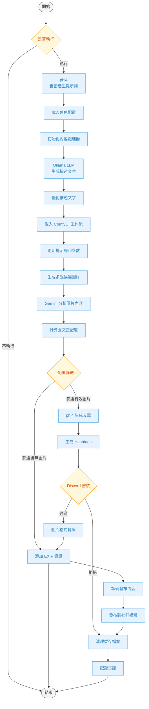
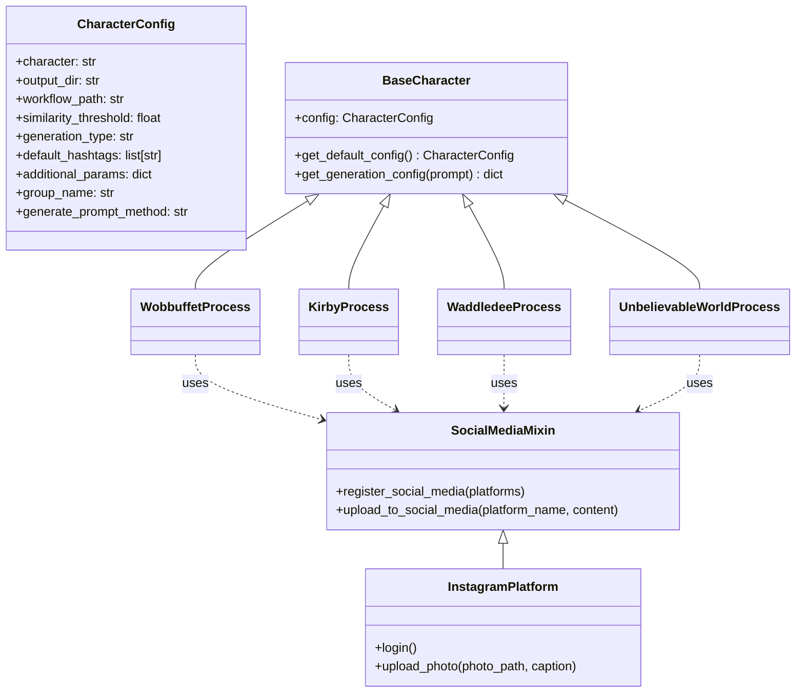
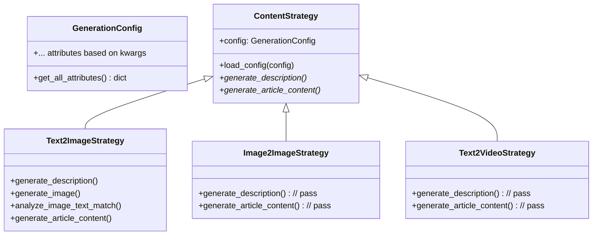

# 社群媒體內容自動生成系統

這是一個自動化的社群媒體內容生成系統，能夠根據提示詞自動生成圖片和文字內容，並發布到各種社群媒體平台。

## 系統需求

1. Python 3.12+
2. Docker & Docker Compose
3. ComfyUI (需要單獨安裝)
4. Ollama (需要單獨安裝)
5. 足夠的硬碟空間 (建議至少 20GB)
6. NVIDIA GPU (建議至少 8GB VRAM)

## 安裝步驟

### 1. 安裝基礎環境
```bash
# 安裝 Python 依賴
pip install -r requirements.txt

# 安裝 Ollama
# Windows WSL2
curl https://ollama.ai/install.sh | sh
# 或從 https://ollama.ai/download 下載安裝檔

# 下載必要的 Ollama 模型
ollama pull llava:13b
ollama pull llama3.2
ollama pull phi4
```

### 2. 安裝 ComfyUI

1. 克隆 ComfyUI 倉庫：
```bash
git clone https://github.com/comfyanonymous/ComfyUI.git
cd ComfyUI
```

2. 安裝 Python 依賴：
```bash
pip install -r requirements.txt
```

3. 下載必要的模型檔案到 `models/checkpoints/` 目錄：
   - novaAnimeXL_ilV25MerryChristmas.safetensors
   - novaAnimeXL_illustriousV20.safetensors
   - novaAnimeXL_illustriousV10.safetensors

4. 下載 LoRA 檔案到 `models/loras/` 目錄：
   - KirbyV2.safetensors

### 3. 配置環境變數

1. 創建並編輯 `media_overload.env` 檔案，填入必要的 API 金鑰和 ID：
```env
discord_review_bot_token=您的Discord機器人Token
discord_review_channel_id=審核頻道ID
gemini_api_token=google ai studio api key
ollama_host=http://host.docker.internal:11434 # 如果使用 Docker 則用這個
# ollama_host=http://localhost:11434 # 如果在本機運行 Ollama
```

2. 設定社群媒體帳號：
   - 參考 `configs/social_media/ig/` 下的角色目錄（如 `kirby` 或 `wobbuffet`）中的 `ig.env` 和 `ig_account.json` 檔案結構。
   - 為你的角色創建對應的目錄和設定檔，例如：
     `configs/social_media/ig/your_character/ig.env`
     `configs/social_media/ig/your_character/ig_account.json`

### 4. 啟動服務

1. 啟動 ComfyUI：
```bash
# 在 ComfyUI 目錄下
python main.py --listen 0.0.0.0 --port 8188
```

2. 啟動 Ollama 服務：
```bash
ollama serve
```

3. 啟動排程器：
```bash
# 使用 Docker Compose
docker-compose up -d

# 或直接執行
python scheduler/scheduler.py
```

## 系統架構

系統採用模組化設計，主要包含以下幾個核心組件：

1. 內容處理器 (ContentProcessor)
2. 角色管理 (Character Management)
3. 策略模式 (Strategy Pattern)
4. 社群媒體整合 (Social Media Integration)
5. 圖片處理 (Image Processing)
6. Discord 審核機制與通知

## 系統流程圖



## 核心組件說明

### 1. 內容處理器 (ContentProcessor)
- 負責協調整個生成流程
- 實現 ETL (Extract, Transform, Load) 處理邏輯
- 管理資源清理

### 2. 角色管理


### 3. 策略模式


## 配置說明

### ComfyUI 工作流程配置

工作流程配置檔案位於 `configs/workflow/` 目錄下，主要包含：

1. 基礎設定：
   - 圖片尺寸：1024x1024
   - 批次大小：1

2. 模型配置：
   - 檢查點：novaAnimeXL 系列模型
   - LoRA：角色專用模型 (如 KirbyV2.safetensors)

3. 採樣器設定：
   - 步數：30
   - CFG：8
   - 採樣器：euler
   - 調度器：normal

### Ollama 模型配置

系統使用多個 Ollama 模型：

1. `llava:13b`：用於圖像分析
2. `llama3.2`：用於文本生成
3. `phi4`：用於輔助生成

模型配置可在 `lib/content_generation/image_content_generator.py` 中調整。

### 排程器配置

排程配置文件位於 `scheduler/schedule_config.yaml`：

```yaml
schedules:
  wobbuffet:
    character: "Wobbuffet"
    prompts:
      - use_llm: true
        character: "Wobbuffet"
        style: "cute and funny"
        temperature: 1.0
  
  kirby:
    character: "Kirby"
    prompts:
      - use_llm: true
        character: "Kirby"
        style: "kawaii and energetic"
        temperature: 1.0
```

## 使用流程

1. 設定環境變數：
   - 設定 Discord 機器人 Token
   - 設定審核頻道 ID
   - 設定 Google AI Studio API Key

2. 選擇或創建角色類別：
   - 繼承 `BaseCharacter`
   - 實現必要的方法
   - 配置角色專屬參數

3. 初始化內容處理器：
   ```python
   from lib.media_auto.media_main_logic import ContentProcessor
   process = ContentProcessor(character_class())
   ```

4. 提供提示詞：
   ```bash
   python run_media_interface.py --character "Wobbuffet" --prompt "Your prompt here"
   ```
   - 系統會自動生成圖文內容
   - 發送到 Discord 頻道等待審核
   - 審核通過後自動發布

5. 自動發布到社群媒體：
   - 支援 Instagram
   - 可擴展支援其他平台

### 手動執行範例 (run_media_interface.py)

你可以使用 `run_media_interface.py` 手動觸發特定角色的內容生成流程。

**快速測試 (使用預設的 'Wobbuffet' 角色和 'text2image' 流程):**

```bash
python run_media_interface.py --prompt "wobbuffet is standing near a tree"
```
這會使用 `WobbuffetProcess` 類別和 `text2image` pipeline 來根據提示詞生成內容。

**完整指令範例 (指定角色、提示詞和流程):**
python run_media_interface.py --character "UnbelievableWorld" --prompt "" --pipeline "text2image"

```bash
python run_media_interface.py --character "Kirby" --prompt "kirby eating a strawberry cake" --pipeline "text2image"
```
這會使用 `KirbyProcess` 類別和 `text2image` pipeline。

**可用的參數:**
*   `--character CHARACTER_NAME`: 指定要使用的角色類別名稱 (例如 `Wobbuffet`, `Kirby`, `Waddledee`, `UnbelievableWorld`)。預設為 `Wobbuffet`。
*   `--prompt "YOUR_PROMPT"`: **(必需)** 提供內容生成的提示詞。
*   `--pipeline PIPELINE_NAME`: 指定要執行的流程。可選值: `text2image`, `image2image`, `text2video`, `complex_media`。預設為 `text2image`。

## 故障排除

1. ComfyUI 連接問題：
   - 確認 ComfyUI 服務正在運行
   - 檢查端口 8188 是否可訪問
   - 確認模型檔案存在且權限正確

2. Ollama 服務問題：
   - 確認 Ollama 服務正在運行
   - 檢查模型是否已正確下載
   - 檢查 Docker 網路設定

3. Discord 審核機制：
   - 確認機器人 Token 正確
   - 確認機器人具有必要權限
   - 檢查審核頻道 ID 設定

4. 社群媒體發布：
   - 確認帳號配置文件格式正確
   - 檢查帳號登入狀態
   - 確認發布權限設定

## 日誌和監控

系統日誌位於 `logs/` 目錄下，按日期命名：
```
logs/
  └─ YYYY-MM-DD.log
```

主要記錄：
- 系統運行狀態
- 內容生成過程
- 錯誤和異常信息
- 發布結果追蹤

## 擴展開發

1. 新增角色：
```python
class NewCharacter(BaseCharacter, SocialMediaMixin):
    character = 'your_character'
    output_dir = '/app/output_image'
    workflow_path = '/app/configs/workflow/your_workflow.json'
    similarity_threshold = 0.9
    type = 'text2img'
    additional_params = {
        'images_per_description': 3,
        'is_negative': False
    }
```

2. 新增生成策略：
```python
from lib.media_auto.strategies.base_strategy import ContentStrategy

class NewStrategy(ContentStrategy):
    def generate_description(self):
        # 實現描述生成邏輯
        pass
```

3. 新增社群平台：
```python
class NewPlatform(SocialMediaMixin):
    def upload_to_social_media(self):
        # 實現平台發布邏輯
        pass
```

## 注意事項

1. 環境變數安全：
   - 不要提交敏感配置到版本控制
   - 使用 .env 文件管理機密信息
   - 定期更新 API 密鑰

2. 資源管理：
   - 定期清理輸出目錄
   - 監控磁盤使用情況
   - 注意 GPU 記憶體使用

3. 錯誤處理：
   - 檢查日誌文件
   - 設置適當的重試機制
   - 實現錯誤通知機制

4. 性能優化：
   - 調整批次處理大小
   - 優化模型參數
   - 監控系統資源使用

## 目錄架構
```
│  .dockerignore
│  .gitignore
│  docker-compose.yml
│  Dockerfile
│  media_overload.env
│  README.md
│  requirements.txt
│  run_media_interface.py
│
├─configs
│  ├─prompt
│  │  │  image_system_guide.py
│  │
│  ├─social_media
│  │  └─ig
│  │      ├─kirby
│  │      │      ig.env
│  │      │      ig_account.json
│  │      │      twitter.env
│  │      │
│  │      ├─waddle dee
│  │      │      ig.env
│  │      │
│  │      └─wobbuffet
│  │              ig.env
│  │              ig_account.json
│  │  └─discord
│  │      Discord.env
│  │
│  └─workflow
│          nova-anime-xl.json
│
├─lib
│  │  discord.py
│  │  social_media.py
│  │
│  ├─comfyui
│  │  │  analyze.py
│  │  │  node_manager.py
│  │  │  websockets_api.py
│  │
│  ├─content_generation
│  │  │  image_content_generator.py
│  │
│  ├─media_auto
│  │  │  media_main_logic.py
│  │  │  process.py
│  │  │
│  │  ├─factory
│  │  │      strategy_factory.py
│  │  │
│  │  └─strategies
│  │      │  base_strategy.py
│  │      │  image_strategies.py
│
├─logs
│      2025-01-26.log
│
├─output_image
├─scheduler
│      scheduler.py
│      schedule_config.yaml
│
└─utils
    │  image.py
    │  logger.py
```
