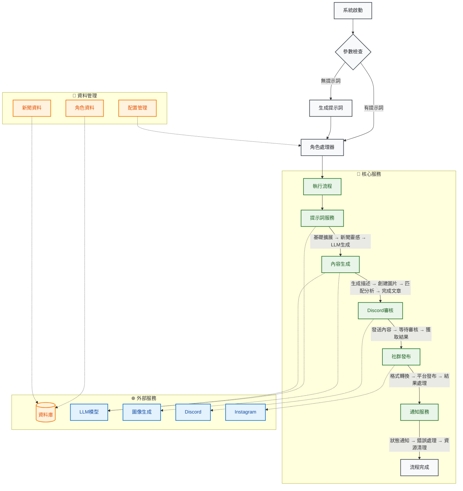

# MediaOverload: 自動化內容生成與社群媒體發布系統

MediaOverload 是一個自動化的內容創作和社群媒體發布系統。它能夠根據指定的角色 (character) 和提示 (prompt)，利用大型語言模型 (LLM) 和 AI 圖像生成工具 (如 ComfyUI) 產生文字描述、文章內容和對應的圖像。生成的内容會經過 Discord 頻道的人工審核，最終發布到 Instagram 等社群平台。

## 核心功能

*   **動態角色處理**: 支援基於不同「角色」的內容生成，每個角色可以有獨立的配置 (例如，使用的 AI workflow、風格、預設標籤等)。
*   **智能提示詞生成**:
    *   可根據用戶提供的基礎提示詞進行擴展。
    *   若未提供提示詞，可利用 Ollama LLM (如 `llama3.2-vision`, `deepseek-r1:8b`) 自動生成。
    *   支援從資料庫中的新聞內容提取靈感，生成與時事相關的提示詞。
*   **多模態內容生成**:
    *   **文字內容**: 生成描述、標題、文章等。
    *   **圖像內容**: 整合 ComfyUI 等 AI 圖像生成工具，根據文字提示生成符合風格的圖像。
*   **內容策略與客製化**:
    *   透過 `StrategyFactory` 模式，可以彈性選擇不同的內容生成策略。
    *   角色配置 (`CharacterConfig`) 允許高度客製化，包括 ComfyUI workflow 路徑、輸出目錄、相似度閾值等。
*   **人工審核流程**: 生成的圖文內容會發送到指定的 Discord 頻道，由人工進行審核、編輯和選擇最終發布的素材。
*   **社群媒體整合**:
    *   目前支援將審核後的內容自動發布到 Instagram。
    *   透過 `SocialMediaMixin` 設計，方便擴展支援更多社群平台。
*   **資料庫整合**:
    *   從 MySQL 資料庫讀取角色群組資訊、新聞內容等，輔助內容生成。
*   **任務排程**: 系統設計為可透過排程器 (如 `docker-compose.yml` 中定義的 `media-scheduler` 服務結合 `schedule` 套件) 自動執行內容生成與發布任務。
*   **容器化部署**: 提供 `Dockerfile` 和 `docker-compose.yml`，方便使用 Docker 進行部署和管理。

## 技術棧

*   **程式語言**: Python 3
*   **核心框架與套件**:
    *   **命令列介面**: `argparse`
    *   **任務排程**: `schedule`
    *   **環境變數管理**: `python-dotenv`
    *   **資料庫互動**: `SQLAlchemy`, `pymysql` (MySQL)
    *   **影像處理**: `Pillow`, `piexif`, `numpy`, `pandas`
    *   **社群平台整合**:
        *   Discord: `discord.py`
        *   Instagram: `instagrapi`
    *   **AI / LLM**:
        *   `ollama` (用於本地部署和調用 LLM，如 Llama 3.2 Vision, Qwen 3)
        *   `google-generativeai`
        *   `websocket-client`, `urllib3` (可能用於與 ComfyUI API 互動)
    *   **設定檔處理**: `PyYAML`
*   **AI 模型/服務**:
    *   Ollama (本地大型語言模型)
    *   Google Generative AI
    *   ComfyUI (AI 圖像生成流程引擎)
*   **資料庫**: MySQL
*   **容器化**: Docker, Docker Compose
*   **日誌**: `logging` 模組 (透過 `utils.logger.setup_logger`)
*   **開發工具**: `rich` (美化終端輸出)

## 專案架構與流程



### 新架構說明

1. **服務層 (Services)**
   - **PromptService**: 負責生成提示詞
     - 基礎提示詞擴展
     - 新聞靈感提取
     - LLM 生成提示詞
   - **ContentGenerationService**: 負責內容生成
     - 文字描述生成
     - 圖片生成（ComfyUI）
     - 圖文匹配度分析
     - 最終文章生成
   - **ReviewService**: 負責 Discord 審核流程
     - 內容發送
     - 人工審核等待
     - 結果處理
   - **PublishingService**: 負責社群媒體發布
     - 圖片處理
     - 平台發布
     - 結果處理
   - **NotificationService**: 負責通知
     - 成功/失敗通知
     - 錯誤處理
     - 資源清理
   - **OrchestrationService**: 工作流程協調
     - 服務調度
     - 錯誤處理
     - 流程控制

2. **資料存取層 (Repositories)**
   - **CharacterRepository**: 角色資料操作
     - 角色查詢
     - 群組管理
     - 配置讀取
   - **NewsRepository**: 新聞資料操作
     - 新聞檢索
     - 內容提取
     - 資料更新
   - **ConfigLoader**: 配置管理
     - YAML 解析
     - 配置驗證
     - 動態載入

3. **配置管理**
   - **ConfigurableCharacter**: 可配置角色基類
     - 配置繼承
     - 動態屬性
     - 驗證機制
   - **YAML 配置結構**:
     ```yaml
     character:
       name: your_character
       group_name: YourGroup
       
     generation:
       output_dir: /app/output_image
       workflow_path: /app/configs/workflow/your-workflow.json
       similarity_threshold: 0.7
       generation_type: text2img
       
       prompt_method_weights:
         arbitrary: 0.3
         news: 0.7
         
       image_system_prompt_weights:
         stable_diffusion_prompt: 0.6
         unbelievable_world_system_prompt: 0.4

     social_media:
       default_hashtags:
         - tag1
         - tag2
       platforms:
         instagram:
           config_folder_path: /app/configs/social_media/ig
           enabled: true

     additional_params:
       images_per_description: 3
       is_negative: false
     ```

### 流程說明

1. **啟動與參數**
   - 腳本 (`run_media_interface.py`) 可由用戶直接執行或由排程器觸發
   - 接收 `character` (角色) 和可選的 `prompt` (提示詞) 作為輸入
   - 支援環境變數配置和命令列參數

2. **角色處理器初始化**
   - 根據 `character` 參數實例化相應的角色處理類別
   - 從 YAML 配置檔案載入角色特定設定
   - 初始化必要的服務和依賴

3. **提示詞生成 (可選)**
   - 如果未提供 `prompt`，`PromptService` 會使用 Ollama LLM 生成
   - 支援多種生成策略：
     - 基礎提示詞擴展
     - 新聞靈感提取
     - 純 LLM 生成
   - 可配置生成策略的權重

4. **工作流程執行**
   - **動態角色選擇**
     - 檢查角色是否屬於群組
     - 從資料庫隨機選擇群組內角色
     - 更新角色配置
   - **配置加載**
     - 載入角色完整生成配置
     - 驗證配置有效性
     - 初始化相關服務
   - **服務協調**
     - `PromptService`: 生成或擴展提示詞
     - `ContentGenerationService`: 生成內容
     - `ReviewService`: 處理審核流程
     - `PublishingService`: 處理發布
     - `NotificationService`: 發送通知

5. **人工審核**
   - 內容發送到 Discord 頻道
   - 等待人工審核和編輯
   - 處理審核結果和反饋

6. **社群媒體發布**
   - 處理選定的圖片（格式轉換等）
   - 發布到配置的社群平台
   - 處理發布結果和錯誤

7. **通知與清理**
   - 發送成功/失敗通知
   - 清理臨時檔案和資源
   - 記錄執行日誌

## 環境設定與執行

### 1. 環境變數

專案依賴 `media_overload.env` 檔案來管理敏感資訊和環境特定配置。請複製或建立此檔案，並填寫必要的憑證和路徑，例如：

```env
# 資料庫 (MySQL)
mysql_host=your_mysql_host
mysql_port=3306
mysql_user=your_mysql_user
mysql_password=your_mysql_password
mysql_db_name=your_mysql_db_name

# Discord
discord_review_bot_token=your_discord_bot_token
discord_review_channel_id=your_discord_channel_id

# Ollama
OLLAMA_API_BASE_URL=http://localhost:11434
OLLAMA_MODEL=llama3.2-vision

# ComfyUI
COMFYUI_API_URL=http://localhost:8188
```
還需要設定 `configs/social_media/discord/Discord.env` (雖然目前主要審核流程的 token 在主 env，但可能用於其他 Discord 功能)。
以及各社群媒體平台的設定檔，例如 Instagram 的設定可能位於 `/app/configs/social_media/ig/` 下，並由對應的角色（如 `wobbuffet.env`）引用。

### 2. 依賴安裝

```bash
pip install -r requirements.txt
```

### 3. ComfyUI / Ollama 設定

*   確保您的 ComfyUI 服務正在運行，並且 API 是可訪問的。相關的 ComfyUI workflow JSON 檔案應放置在 `configs/workflow/` 目錄下。
*   確保 Ollama 服務正在運行，並且已下載所需的模型 (如 `llama3.2-vision`, `qwen3:8b`)。

### 4. 資料庫設定

*   確保 MySQL 資料庫已建立，並且相關的表 (如 `anime.anime_roles`, `news_ch.news`) 已存在且包含所需資料。

### 5. 執行

可以直接執行主腳本：

```bash
python run_media_interface.py --character <CharacterName> --prompt "Your creative prompt here"
```
例如:
```bash
python run_media_interface.py --character Wobbuffet --prompt "A funny scene with Wobbuffet trying to bake a cake"
```

如果 `--prompt` 未提供，系統將嘗試自動生成。

### 6. 使用 Docker 運行 (推薦)

專案提供了 `Dockerfile` 和 `docker-compose.yml`，可以使用 Docker Compose 啟動 `media-scheduler` 服務：

```bash
docker-compose up --build -d
```
此服務可能會根據內建的排程邏輯 (例如使用 `scheduler` 資料夾下的腳本和 `schedule` 套件) 定期觸發內容生成流程。

## 主要模組說明

*   `run_media_interface.py`: 專案的命令列入口點，解析參數並啟動內容處理流程。
*   `lib/services/`: 包含各種服務實現，負責整個工作流程的協調，包括提示詞生成、內容生成、Discord 審核和社群媒體發布。
*   `lib/media_auto/strategies/`: (推測) 包含不同的內容生成策略，例如與 ComfyUI 互動的策略 (`StrategyFactory` 會從這裡載入)。
*   `lib/content_generation/`: (推測) 包含與 LLM 互動生成文字內容 (如提示詞、描述、文章) 的邏輯，例如 `VisionManagerBuilder`。
*   `lib/social_media/`: 包含社群媒體發布的通用邏輯 (`SocialMediaMixin`, `MediaPost`) 和特定平台的實現 (如 `InstagramPlatform`)。
*   `lib/discord/`: 處理與 Discord API 的互動，主要是內容審核流程。
*   `lib/database/`: 提供資料庫連接池和操作的封裝。
*   `utils/`: 包含輔助工具，如日誌設定 (`logger.py`)、圖像處理 (`image.py`)。
*   `configs/`: 存放專案的各種設定檔。
    *   `workflow/`: 存放 ComfyUI 的 workflow JSON 檔案。
    *   `social_media/`: 存放各社群媒體平台及帳號的設定檔。
*   `scheduler/`: (推測) 包含用於排程任務的腳本。
*   `output_image/`: 生成的圖片預設會輸出到此目錄下以角色名命名的子資料夾中。
*   `logs/`: 存放應用程式日誌。

## 注意事項

*   專案中的許多路徑 (如 `workflow_path`, `output_dir`) 在 Docker 環境下是 `/app/...`，在本地運行時請確保路徑對應正確或進行相應調整。
*   社群媒體平台的登入憑證和 API token 需要安全管理，並正確配置在 `.env` 檔案或相應的設定檔中。
