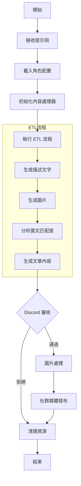
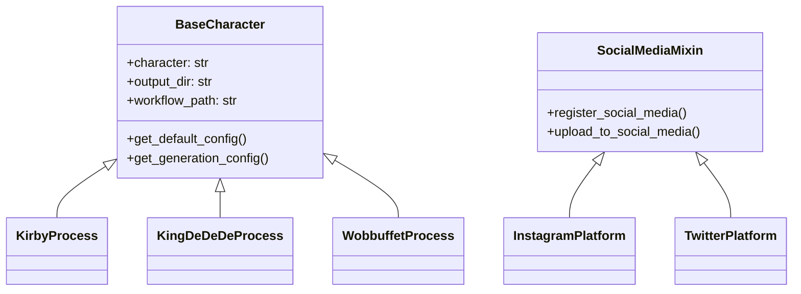
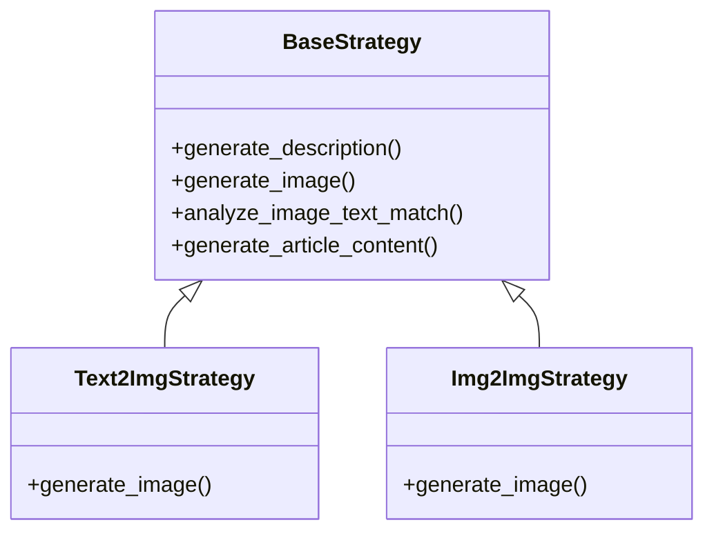

# 社群媒體內容自動生成系統

這是一個自動化的社群媒體內容生成系統，能夠根據提示詞自動生成圖片和文字內容，並發布到各種社群媒體平台。

## 系統架構

系統採用模組化設計，主要包含以下幾個核心組件：

1. 內容處理器 (ContentProcessor)
2. 角色管理 (Character Management)
3. 策略模式 (Strategy Pattern)
4. 社群媒體整合 (Social Media Integration)
5. 圖片處理 (Image Processing)
6. Discord 審核機制

## 系統流程圖



## 核心組件說明

### 1. 內容處理器 (ContentProcessor)
- 負責協調整個生成流程
- 實現 ETL (Extract, Transform, Load) 處理邏輯
- 管理資源清理

### 2. 角色管理


### 3. 策略模式


## 配置要求

### 環境變數 (media_overload.env)
```
discord_review_bot_token=您的Discord機器人Token
discord_review_channel_id=審核頻道ID
gemini_api_token=google ai studio api key
```

### 目錄結構
```
│  media_overload.env
│  README.md
│  run_media_interface.py
│
├─configs
│  ├─prompt
│  │  │  image_system_guide.py
│  │
│  ├─social_media
│  │  └─ig
│  │      ├─kirby
│  │      │      ig.env
│  │      │      ig_account.json
│  │      │      twitter.env
│  │      │
│  │      └─wobbuffet
│  │              ig.env
│  │              ig_account.json
│  │
│  └─worflow
│          nova-anime-xl.json
│
├─lib
│  │  discord.py
│  │  social_media.py
│  │
│  ├─comfyui
│  │  │  analyze.py
│  │  │  node_manager.py
│  │  │  websockets_api.py
│  │
│  ├─content_generation
│  │  │  image_content_generator.py
│  ├─media_auto
│  │  │  media_main_logic.py
│  │  │  process.py
│  │  ├─factory
│  │  │  │  strategy_factory.py
│  │  ├─strategies
│  │  │  │  base_strategy.py
│  │  │  │  image_strategies.py
├─output_image
└─utils
    │  image.py
```

## 使用流程

1. 設定環境變數 (ig.env, media_overload.env, ...)
2. 選擇或創建角色類別
3. 初始化內容處理器
4. 提供提示詞
5. 等待內容生成與審核
6. 自動發布到社群媒體

## 特色功能

1. 多角色支援
2. 自動圖文生成
3. AI 圖文匹配度分析
4. Discord 人工審核機制
5. 自動圖片格式轉換
6. 多平台社群媒體發布

## 擴展性

系統設計上採用了策略模式和混入(Mixin)的方式，方便擴展：

1. 新增角色：繼承 BaseCharacter
2. 新增生成策略：繼承 BaseStrategy
3. 新增社群平台：實現相應的平台類別

## 注意事項

1. 確保所有必要的環境變數都已正確設定
2. Discord 審核機制需要正確的機器人權限設定
3. 社群媒體發布需要相應的認證資訊
4. 圖片生成需要足夠的系統資源

## 執行產生貼文ETL流程
```sh
python run_media_interface.py --character "Wobbuffet" --prompt "Wobbuffet get many money in 
white envelope sticked love"
```