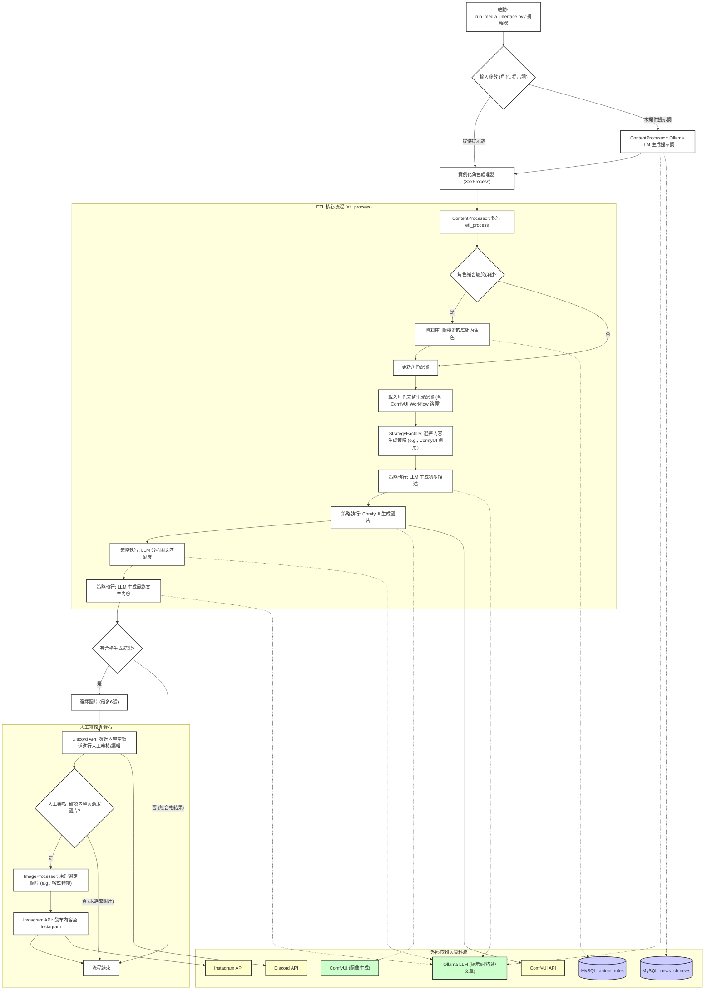

# MediaOverload: 自動化內容生成與社群媒體發布系統

MediaOverload 是一個自動化的內容創作和社群媒體發布系統。它能夠根據指定的角色 (character) 和提示 (prompt)，利用大型語言模型 (LLM) 和 AI 圖像生成工具 (如 ComfyUI) 產生文字描述、文章內容和對應的圖像。生成的内容會經過 Discord 頻道的人工審核，最終發布到 Instagram 等社群平台。

## 核心功能

*   **動態角色處理**: 支援基於不同「角色」的內容生成，每個角色可以有獨立的配置 (例如，使用的 AI workflow、風格、預設標籤等)。
*   **智能提示詞生成**:
    *   可根據用戶提供的基礎提示詞進行擴展。
    *   若未提供提示詞，可利用 Ollama LLM (如 `llama3.2-vision`, `qwen3:8b`) 自動生成。
    *   支援從資料庫中的新聞內容提取靈感，生成與時事相關的提示詞。
*   **多模態內容生成**:
    *   **文字內容**: 生成描述、標題、文章等。
    *   **圖像內容**: 整合 ComfyUI 等 AI 圖像生成工具，根據文字提示生成符合風格的圖像。
*   **內容策略與客製化**:
    *   透過 `StrategyFactory` 模式，可以彈性選擇不同的內容生成策略。
    *   角色配置 (`CharacterConfig`) 允許高度客製化，包括 ComfyUI workflow 路徑、輸出目錄、相似度閾值等。
*   **人工審核流程**: 生成的圖文內容會發送到指定的 Discord 頻道，由人工進行審核、編輯和選擇最終發布的素材。
*   **社群媒體整合**:
    *   目前支援將審核後的內容自動發布到 Instagram。
    *   透過 `SocialMediaMixin` 設計，方便擴展支援更多社群平台。
*   **資料庫整合**:
    *   從 MySQL 資料庫讀取角色群組資訊、新聞內容等，輔助內容生成。
*   **任務排程**: 系統設計為可透過排程器 (如 `docker-compose.yml` 中定義的 `media-scheduler` 服務結合 `schedule` 套件) 自動執行內容生成與發布任務。
*   **容器化部署**: 提供 `Dockerfile` 和 `docker-compose.yml`，方便使用 Docker 進行部署和管理。

## 技術棧

*   **程式語言**: Python 3
*   **核心框架與套件**:
    *   **命令列介面**: `argparse`
    *   **任務排程**: `schedule`
    *   **環境變數管理**: `python-dotenv`
    *   **資料庫互動**: `SQLAlchemy`, `pymysql` (MySQL)
    *   **影像處理**: `Pillow`, `piexif`, `numpy`, `pandas`
    *   **社群平台整合**:
        *   Discord: `discord.py`
        *   Instagram: `instagrapi`
    *   **AI / LLM**:
        *   `ollama` (用於本地部署和調用 LLM，如 Llama 3.2 Vision, Qwen 3)
        *   `google-generativeai`
        *   `websocket-client`, `urllib3` (可能用於與 ComfyUI API 互動)
    *   **設定檔處理**: `PyYAML`
*   **AI 模型/服務**:
    *   Ollama (本地大型語言模型)
    *   Google Generative AI
    *   ComfyUI (AI 圖像生成流程引擎)
*   **資料庫**: MySQL
*   **容器化**: Docker, Docker Compose
*   **日誌**: `logging` 模組 (透過 `utils.logger.setup_logger`)
*   **開發工具**: `rich` (美化終端輸出)

## 專案架構與流程



### 流程說明：

1.  **啟動與參數**: 腳本 (`run_media_interface.py`) 可由用戶直接執行或由排程器觸發，接收 `character` (角色) 和可選的 `prompt` (提示詞) 作為輸入。
2.  **角色處理器初始化**: 根據 `character` 參數，系統會實例化相應的角色處理類別 (例如 `WobbuffetProcess`)，該類別繼承自 `BaseCharacter` 並載入該角色的特定配置 (如 ComfyUI workflow 路徑、預設標籤等)。
3.  **提示詞生成 (可選)**: 如果未提供 `prompt`，`ContentProcessor` 會使用 Ollama LLM (例如 `llama3.2-vision`, `qwen3:8b`) 生成提示詞。此過程可能結合角色配置的 `generate_prompt_method` ('default' 或 'news')，後者會從資料庫讀取新聞內容作為靈感。
4.  **ETL 核心處理 (`ContentProcessor.etl_process`)**:
    *   **動態角色選擇**: 若角色配置了 `group_name`，系統會從資料庫 (`anime.anime_roles`) 中隨機選擇一個隸屬於該群組的角色來執行任務。
    *   **配置加載**: 加載選定角色的完整生成配置，包括用於 ComfyUI 的 workflow JSON 檔案路徑。
    *   **策略選擇與執行**:
        *   `StrategyFactory` 根據配置中的 `generation_type` (通常是 'text2img') 選擇合適的內容生成策略。
        *   該策略將協調 LLM 和 ComfyUI：
            *   使用 LLM 生成初步的文字描述。
            *   調用 ComfyUI (基於 workflow) 生成圖像。
            *   使用 LLM 分析生成圖像與文字描述的匹配度。
            *   使用 LLM 基於圖像和描述生成最終的文章內容。
5.  **人工審核**: 經過初步篩選的圖像 (最多6張) 和生成的文章內容，會被發送到指定的 Discord 頻道。人工操作員可以在此頻道審核內容、進行必要的編輯，並選擇最終要發布的圖像。
6.  **圖像後處理**: 用戶在 Discord 中選定的圖像會經過 `ImageProcessor` 處理 (例如，轉換為 Instagram 偏好的 JPG 格式)。
7.  **社群媒體發布**: 最終確認的內容 (圖像和編輯後的文字) 將通過相應的社群媒體平台處理器 (目前為 `InstagramPlatform`) 發布到 Instagram。
8.  **清理與記錄**: 流程結束後，可能會執行清理操作 (例如刪除臨時檔案)，並記錄執行時間和結果。

## 環境設定與執行

### 1. 環境變數

專案依賴 `media_overload.env` 檔案來管理敏感資訊和環境特定配置。請複製或建立此檔案，並填寫必要的憑證和路徑，例如：

```env
# 資料庫 (MySQL)
mysql_host=your_mysql_host
mysql_port=3306
mysql_user=your_mysql_user
mysql_password=your_mysql_password
mysql_db_name=your_mysql_db_name

# Discord
discord_review_bot_token=your_discord_bot_token
discord_review_channel_id=your_discord_channel_id

# 其他 (根據需要添加)
# OLLAMA_API_BASE_URL=http://localhost:11434 (如果 Ollama 不在預設位置)
```
還需要設定 `configs/social_media/discord/Discord.env` (雖然目前主要審核流程的 token 在主 env，但可能用於其他 Discord 功能)。
以及各社群媒體平台的設定檔，例如 Instagram 的設定可能位於 `/app/configs/social_media/ig/` 下，並由對應的角色（如 `wobbuffet.env`）引用。

### 2. 依賴安裝

```bash
pip install -r requirements.txt
```

### 3. ComfyUI / Ollama 設定

*   確保您的 ComfyUI 服務正在運行，並且 API 是可訪問的。相關的 ComfyUI workflow JSON 檔案應放置在 `configs/workflow/` 目錄下。
*   確保 Ollama 服務正在運行，並且已下載所需的模型 (如 `llama3.2-vision`, `qwen3:8b`)。

### 4. 資料庫設定

*   確保 MySQL 資料庫已建立，並且相關的表 (如 `anime.anime_roles`, `news_ch.news`) 已存在且包含所需資料。

### 5. 執行

可以直接執行主腳本：

```bash
python run_media_interface.py --character <CharacterName> --prompt "Your creative prompt here"
```
例如:
```bash
python run_media_interface.py --character Wobbuffet --prompt "A funny scene with Wobbuffet trying to bake a cake"
```

如果 `--prompt` 未提供，系統將嘗試自動生成。

### 6. 使用 Docker 運行 (推薦)

專案提供了 `Dockerfile` 和 `docker-compose.yml`，可以使用 Docker Compose 啟動 `media-scheduler` 服務：

```bash
docker-compose up --build -d
```
此服務可能會根據內建的排程邏輯 (例如使用 `scheduler` 資料夾下的腳本和 `schedule` 套件) 定期觸發內容生成流程。

## 主要模組說明

*   `run_media_interface.py`: 專案的命令列入口點，解析參數並啟動內容處理流程。
*   `lib/media_auto/media_main_logic.py`: 包含核心的 `ContentProcessor` 類，負責整個 ETL 流程的協調，包括提示詞生成、內容生成、Discord 審核和社群媒體發布。
*   `lib/media_auto/process.py`: 定義了 `BaseCharacter` 抽象類和各種具體的角色處理類 (如 `WobbuffetProcess`)。這些類封裝了每個角色的特定配置和行為。
*   `lib/media_auto/strategies/`: (推測) 包含不同的內容生成策略，例如與 ComfyUI 互動的策略 (`StrategyFactory` 會從這裡載入)。
*   `lib/content_generation/`: (推測) 包含與 LLM 互動生成文字內容 (如提示詞、描述、文章) 的邏輯，例如 `VisionManagerBuilder`。
*   `lib/social_media/`: 包含社群媒體發布的通用邏輯 (`SocialMediaMixin`, `MediaPost`) 和特定平台的實現 (如 `InstagramPlatform`)。
*   `lib/discord/`: 處理與 Discord API 的互動，主要是內容審核流程。
*   `lib/database/`: 提供資料庫連接池和操作的封裝。
*   `utils/`: 包含輔助工具，如日誌設定 (`logger.py`)、圖像處理 (`image.py`)。
*   `configs/`: 存放專案的各種設定檔。
    *   `workflow/`: 存放 ComfyUI 的 workflow JSON 檔案。
    *   `social_media/`: 存放各社群媒體平台及帳號的設定檔。
*   `scheduler/`: (推測) 包含用於排程任務的腳本。
*   `output_image/`: 生成的圖片預設會輸出到此目錄下以角色名命名的子資料夾中。
*   `logs/`: 存放應用程式日誌。

## 注意事項

*   專案中的許多路徑 (如 `workflow_path`, `output_dir`) 在 Docker 環境下是 `/app/...`，在本地運行時請確保路徑對應正確或進行相應調整。
*   社群媒體平台的登入憑證和 API token 需要安全管理，並正確配置在 `.env` 檔案或相應的設定檔中。
