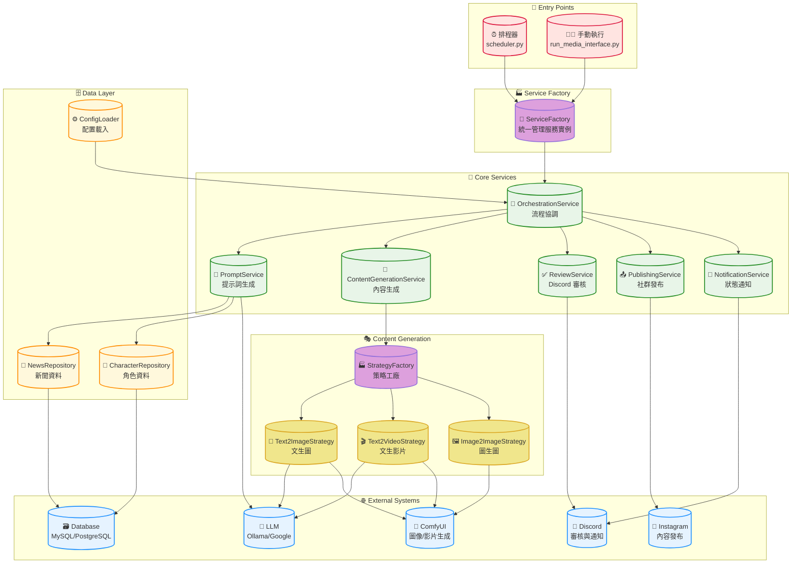
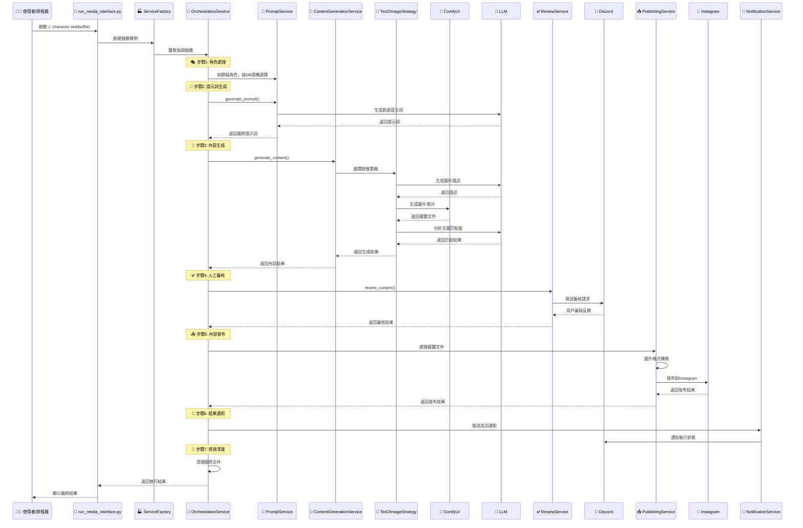

# MediaOverload: AI 驅動的自動化內容生成與多平台發布系統

MediaOverload 是一個高度自動化的內容創作與社群媒體發布引擎。它能根據指定的「角色」配置，結合大型語言模型 (LLM)、AI 圖像及影片生成技術，產出多樣化的內容。從提示詞生成、多媒體創作，到人工審核與最終發布，實現了完整的自動化工作流。

## 🚀 快速開始

### 一鍵部署 (推薦)
```bash
# 1. 克隆專案
git clone https://github.com/your-repo/mediaoverload.git
cd mediaoverload

# 2. 配置環境變數
cp media_overload.env.example media_overload.env
# 編輯 media_overload.env 填入你的配置

# 3. 啟動服務
docker-compose up --build -d
```

### 手動執行
```bash
# 生成 wobbuffet 角色的內容
python run_media_interface.py --character wobbuffet --prompt "Wobbuffet trying to bake a cake"

# 使用配置文件
python run_media_interface.py --config configs/characters/kirby.yaml
```

## ✨ 核心功能

*   **🎭 動態角色系統**:
    *   以「角色」(Character) 為核心，每個角色擁有獨立的風格、AI 模型、發布平台和內容策略。
    *   支援角色群組，可在執行時從群組中動態選擇角色，增加內容多樣性。

*   **🧠 智慧提示詞引擎**:
    *   **無提示啟動**: 若未提供，可利用本地 LLM (如 Ollama) 自動生成創意提示詞。
    *   **多策略生成**: 結合新聞時事、預設模板等多種方式生成或擴展提示詞，並可配置不同策略的權重。

*   **🎨 多模態內容生成**:
    *   **文案創作**: 自動生成標題、描述、標籤 (Hashtags) 等。
    *   **圖像生成 (Text-to-Image)**: 整合 ComfyUI，根據提示詞和角色風格生成高品質圖像。
    *   **影片生成 (Text-to-Video)**: 支援實驗性的文字轉影片功能，可生成短影片內容並附加音訊。

*   **🔧 彈性的生成策略**:
    *   透過策略模式 (`StrategyFactory`)，可為不同任務（如圖像生成、影片生成）配置和切換不同的後端實現。
    *   角色配置 (`CharacterConfig`) 允許高度客製化，包括 AI 工作流、輸出選項、相似度閾值等。

*   **✅ 人工審核流程**:
    *   生成的圖文/影音內容會發送到指定的 Discord 頻道，由人工進行審核、篩選和批准。
    *   確保最終發布的內容品質符合預期。

*   **🚀 社群媒體整合**:
    *   內建 Instagram 發布功能，可將審核後的內容自動發布。
    *   透過 `social_media.py` 的可擴展設計，未來可方便地支援 Twitter、Facebook 等更多平台。

*   **🌐 資料庫整合**:
    *   從資料庫讀取角色群組、新聞時事等外部資料，為內容創作提供靈感。
    *   支援 MySQL, PostgreSQL 等多種資料庫。

*   **⏰ 自動化排程**:
    *   透過 `scheduler/scheduler.py` 和 `schedule` 套件，可設定定時任務，自動執行內容生成與發布流程。
    *   可搭配 Docker Compose 進行部署，實現 "set-it-and-forget-it" 的自動化。

## 🛠️ 技術棧

*   **程式語言**: Python 3.12
*   **核心框架與套件**:
    *   **設定檔**: `PyYAML`
    *   **任務排程**: `schedule`
    *   **環境變數**: `python-dotenv`
    *   **資料庫**: `SQLAlchemy` (支援 `pymysql` for MySQL, `psycopg2` for PostgreSQL, `pyodbc`)
    *   **多媒體處理**: `Pillow` (圖像), `piexif` (EXIF), `numpy`, `pandas`
    *   **命令列介面**: `argparse`
    *   **開發工具**: `rich` (美化終端輸出)
*   **AI / LLM**:
    *   **本地模型**: `ollama`
    *   **雲端模型**: `google-generativeai`
    *   **ComfyUI API**: `websocket-client`
*   **核心服務與平台**:
    *   **AI 工作流引擎**: ComfyUI
    *   **大型語言模型**: Ollama (Llama 3, Qwen, etc.), Google Gemini
    *   **資料庫**: MySQL, PostgreSQL
    *   **審核與通知**: Discord
    *   **發布平台**: Instagram
*   **容器化**: Docker, Docker Compose

## 🏗️ 系統架構

系統採用了現代化的服務導向架構，將不同職責分離到獨立的模組中，提高了可維護性和擴展性。

### 整體架構圖



### 詳細執行流程



### 配置驅動的工作流程

```mermaid
flowchart TD
    Start([開始]) --> LoadChar[載入角色配置]
    LoadChar --> CheckGroup{是否群組角色？}
    
    CheckGroup -->|是| RandomSelect[從資料庫隨機選擇角色]
    CheckGroup -->|否| UseConfig[使用指定角色]
    
    RandomSelect --> GeneratePrompt[生成提示詞]
    UseConfig --> GeneratePrompt
    
    GeneratePrompt --> CheckMethod{提示詞生成方式}
    CheckMethod -->|arbitrary| DefaultPrompt[使用默認LLM生成]
    CheckMethod -->|news| NewsPrompt[結合新聞資料生成]
    CheckMethod -->|two_character| TwoCharPrompt[雙角色互動生成]
    
    DefaultPrompt --> SelectStrategy[選擇生成策略]
    NewsPrompt --> SelectStrategy
    TwoCharPrompt --> SelectStrategy
    
    SelectStrategy --> CheckType{生成類型}
    CheckType -->|text2img| T2IStrategy[文生圖策略]
    CheckType -->|text2video| T2VStrategy[文生影片策略]
    CheckType -->|img2img| I2IStrategy[圖生圖策略]
    
    T2IStrategy --> GenerateDesc[生成描述]
    T2VStrategy --> GenerateDesc
    I2IStrategy --> GenerateDesc
    
    GenerateDesc --> GenerateMedia[生成媒體文件]
    GenerateMedia --> AnalyzeMatch[分析文圖匹配度]
    AnalyzeMatch --> FilterResults[篩選結果]
    
    FilterResults --> CheckResults{是否有合適結果？}
    CheckResults -->|否| Cleanup[清理並結束]
    CheckResults -->|是| PrepareReview[準備審核]
    
    PrepareReview --> DiscordReview[Discord審核]
    DiscordReview --> WaitApproval[等待人工審核]
    WaitApproval --> CheckApproval{審核是否通過？}
    
    CheckApproval -->|否| Cleanup
    CheckApproval -->|是| ProcessMedia[處理媒體文件]
    
    ProcessMedia --> PublishSocial[發布到社群媒體]
    PublishSocial --> SendNotification[發送通知]
    SendNotification --> Cleanup
    Cleanup --> End([結束])
    
    classDef startEnd fill:#FFE4E1,stroke:#DC143C,stroke-width:2px
    classDef process fill:#E8F5E8,stroke:#228B22,stroke-width:2px
    classDef decision fill:#FFF8DC,stroke:#FF8C00,stroke-width:2px
    classDef strategy fill:#F0E68C,stroke:#DAA520,stroke-width:2px
    classDef external fill:#E6F3FF,stroke:#1E90FF,stroke-width:2px
    
    class Start,End startEnd
    class LoadChar,GeneratePrompt,GenerateDesc,GenerateMedia,AnalyzeMatch,FilterResults,PrepareReview,ProcessMedia,PublishSocial,SendNotification,Cleanup process
    class CheckGroup,CheckMethod,CheckType,CheckResults,CheckApproval decision
    class T2IStrategy,T2VStrategy,I2IStrategy strategy
    class DefaultPrompt,NewsPrompt,TwoCharPrompt,DiscordReview,WaitApproval external
```



## 📋 詳細設定指南

### 1. 環境設定

#### 必要的環境變數 (`media_overload.env`)
```env
# 資料庫設定 (MySQL/PostgreSQL)
DB_TYPE=mysql
DB_HOST=localhost
DB_PORT=3306
DB_USER=your_username
DB_PASSWORD=your_password
DB_NAME=your_database

# Discord 審核機器人
DISCORD_REVIEW_BOT_TOKEN=your_bot_token
DISCORD_REVIEW_CHANNEL_ID=your_channel_id

# AI 服務
OLLAMA_API_BASE_URL=http://localhost:11434
OLLAMA_MODEL=llama3.2:latest
COMFYUI_API_URL=http://localhost:8188

# Google Gemini (可選)
GOOGLE_API_KEY=your_google_api_key
```

#### 社群媒體憑證 (`configs/social_media/ig/{character}/ig.env`)
```env
# Instagram 帳號資訊
INSTAGRAM_USERNAME=your_username
INSTAGRAM_PASSWORD=your_password
```

### 2. 角色配置詳解

角色配置是系統的核心，每個角色都有獨立的 YAML 配置文件：

```yaml
# 角色基本資訊
character:
  name: kirby                    # 角色名稱
  group_name: Kirby              # 角色群組（用於隨機選擇）
  
generation:
  output_dir: /app/output_media  # 輸出目錄
  
  # 生成類型權重 (系統會根據權重隨機選擇)
  generation_type_weights:
    text2img: 0.8               # 80% 機率生成圖片
    text2video: 0.2             # 20% 機率生成影片
  
  # 對應的工作流配置
  workflows:
    text2img: /app/configs/workflow/nova-anime-xl.json
    text2video: /app/configs/workflow/wan2.1_t2v_audio.json
  
  similarity_threshold: 0.7      # 文圖匹配度閾值
  
  # 提示詞生成方法權重
  prompt_method_weights:
    arbitrary: 0.3              # 30% 使用默認生成
    news: 0.5                   # 50% 結合新聞
    two_character_interaction: 0.2  # 20% 雙角色互動
    
  # 圖像系統提示詞權重
  image_system_prompt_weights:
    stable_diffusion_prompt: 0.4
    two_character_interaction_generate_system_prompt: 0.6
  
  style: "anime style with vibrant colors"  # 風格描述

social_media:
  default_hashtags:
    - "#kirby"
    - "#nintendo"
  platforms:
    instagram:
      config_folder_path: /app/configs/social_media/ig/kirby
      enabled: true

additional_params:
  image:
    images_per_description: 10   # 每個描述生成的圖片數量
    custom_node_updates:         # 自定義 ComfyUI 節點參數
      - node_type: "PrimitiveInt"
        inputs:
          value: 1024
```

### 3. 後端服務設定

#### ComfyUI 設定
```bash
# 確保 ComfyUI 在 8188 端口運行
cd /path/to/ComfyUI
python main.py --listen 0.0.0.0 --port 8188
```

#### Ollama 設定
```bash
# 安裝並啟動 Ollama
ollama serve

# 下載必要模型
ollama pull llama3.2:latest
ollama pull llama3.2-vision:latest
ollama pull llava:13b
```

#### 資料庫設定
```sql
-- 創建角色表
CREATE TABLE characters (
    id INT AUTO_INCREMENT PRIMARY KEY,
    name VARCHAR(255) NOT NULL,
    group_name VARCHAR(255),
    workflow_type VARCHAR(100),
    created_at TIMESTAMP DEFAULT CURRENT_TIMESTAMP
);

-- 創建新聞表
CREATE TABLE news (
    id INT AUTO_INCREMENT PRIMARY KEY,
    title VARCHAR(500) NOT NULL,
    keyword VARCHAR(200),
    content TEXT,
    publish_date DATE,
    created_at TIMESTAMP DEFAULT CURRENT_TIMESTAMP
);
```

## 🔧 開發與維護指南

### 新增角色
1. 在 `configs/characters/` 創建新的 YAML 配置文件
2. 在 `configs/social_media/ig/` 創建對應的資料夾和憑證
3. 如需要群組功能，在資料庫中添加角色記錄

### 新增社群媒體平台
1. 在 `lib/social_media.py` 中實現新的平台類別
2. 在 `PublishingService` 中註冊新平台
3. 更新角色配置以支持新平台

### 新增生成策略
1. 繼承 `ContentStrategy` 基類
2. 實現必要的方法：`generate_description()`, `generate_media()`, `analyze_media_text_match()`
3. 在 `StrategyFactory` 中註冊新策略

### 自定義 ComfyUI 工作流
1. 在 ComfyUI 中設計工作流
2. 導出為 JSON 格式
3. 放置在 `configs/workflow/` 目錄
4. 在角色配置中引用

## 🐛 故障排除

### 常見問題

#### 1. Discord 審核無回應
- 檢查 Discord Bot Token 是否正確
- 確認 Bot 有頻道的讀寫權限
- 檢查頻道 ID 是否正確

#### 2. ComfyUI 連接失敗
- 確認 ComfyUI 服務正在運行
- 檢查 API URL 和端口配置
- 查看 ComfyUI 日誌是否有錯誤

#### 3. 圖片生成失敗
- 檢查 ComfyUI 工作流 JSON 是否有效
- 確認所需的模型已下載
- 檢查 GPU 記憶體是否充足

#### 4. 資料庫連接錯誤
- 確認資料庫服務正在運行
- 檢查連接參數是否正確
- 確認資料庫表結構是否正確

### 日誌檢查
```bash
# 查看容器日誌
docker-compose logs -f media-scheduler

# 查看特定服務日誌
docker-compose logs -f media-scheduler | grep ERROR

# 查看本地日誌文件
tail -f logs/media_scheduler.log
```

## 🚀 部署方案

### Docker 部署 (推薦)
```yaml
# docker-compose.yml
version: '3.8'

services:
  media-scheduler:
    build: .
    volumes:
      - ./configs:/app/configs
      - ./output_media:/app/output_media
      - ./logs:/app/logs
    env_file:
      - media_overload.env
    restart: unless-stopped
    depends_on:
      - mysql
      - redis

  mysql:
    image: mysql:8.0
    environment:
      MYSQL_ROOT_PASSWORD: rootpassword
      MYSQL_DATABASE: mediaoverload
    volumes:
      - mysql_data:/var/lib/mysql
    restart: unless-stopped

volumes:
  mysql_data:
```

### 系統服務部署
```bash
# 創建 systemd 服務文件
sudo nano /etc/systemd/system/mediaoverload.service

[Unit]
Description=MediaOverload Service
After=network.target

[Service]
Type=simple
User=your_user
WorkingDirectory=/path/to/mediaoverload
ExecStart=/usr/bin/python3 scheduler/scheduler.py
Restart=always
RestartSec=10

[Install]
WantedBy=multi-user.target

# 啟動服務
sudo systemctl enable mediaoverload
sudo systemctl start mediaoverload
```

## 📊 監控與分析

### 效能監控
- 使用 `logs/` 目錄下的日誌文件監控系統狀態
- 透過 Discord 通知獲取即時執行狀態
- 監控資料庫連接池狀態

### 內容分析
- 文圖匹配度統計
- 生成成功率分析
- 社群媒體互動數據

## 🔄 更新日誌

### v2.0.0 (Latest)
- 🏗️ 重構為服務導向架構
- 🎭 支援可配置角色系統
- 🔄 實現策略模式
- 📊 改進錯誤處理和日誌記錄

### v1.0.0
- 🎉 初始版本發布
- 🎨 基本文生圖功能
- 📱 Instagram 發布支援

## 🤝 貢獻指南

歡迎提交 Issues 和 Pull Requests！

### 開發環境設置
```bash
# 克隆專案
git clone https://github.com/your-repo/mediaoverload.git

# 安裝依賴
pip install -r requirements.txt

# 設定開發環境
cp media_overload.env.example media_overload.env
```

### 代碼規範
- 使用 Python 3.12+
- 遵循 PEP 8 代碼風格
- 添加適當的類型提示
- 編寫單元測試

## 📄 授權條款

本專案使用 MIT 授權條款 - 詳見 [LICENSE](LICENSE) 文件。

## ⚠️ 注意事項

*   **路徑設定**: 請確保 Docker 容器內外的路徑對應正確
*   **憑證安全**: 請使用 `.env` 文件管理敏感資訊，勿直接寫入程式碼
*   **資源管理**: 定期清理生成的媒體文件以節省儲存空間
*   **API 限制**: 注意各服務的 API 調用限制，避免超出配額

---

💡 **提示**: 建議在生產環境中使用 Docker 部署，並設置適當的監控和備份策略。
