# MediaOverload: AI 驅動的自動化內容生成與多平台發布系統

MediaOverload 是一個高度自動化的內容創作與社群媒體發布引擎。它能根據指定的「角色」配置，結合大型語言模型 (LLM)、AI 圖像及影片生成技術，產出多樣化的內容。從提示詞生成、多媒體創作，到人工審核與最終發布，實現了完整的自動化工作流。

## 🚀 快速開始

### 📚 範例優先 (最快上手)

如果您想快速體驗圖片生成功能，可以直接使用我們的範例系統：

#### 選項 1: Jupyter Notebook（推薦）
```bash
jupyter notebook examples/quick_draw_examples.ipynb
```

#### 選項 2: Python 腳本
```bash
python examples/quick_draw_example.py
```

範例特點：
- ✅ **跳過耗時步驟** - 不進行圖文匹配分析和文章生成
- ✅ **快速生成** - 專注於圖片生成，適合測試和學習
- ✅ **完整範例** - 包含 6 種不同的使用案例
- ✅ **互動式環境** - Jupyter Notebook 可直接顯示圖片

詳細說明請參考 [examples/README.md](examples/README.md)

### 一鍵部署 (推薦)
```bash
# 1. 克隆專案
git clone https://github.com/your-repo/mediaoverload.git
cd mediaoverload

# 2. 配置環境變數（使用範例檔案）
cp media_overload.env.example media_overload.env
cp configs/social_media/discord/Discord.env.example configs/social_media/discord/Discord.env

# 為角色設定憑證（以 kirby 為例）
mkdir -p configs/social_media/credentials/kirby
cp configs/social_media/credentials/ig.env.example configs/social_media/credentials/kirby/ig.env
cp configs/social_media/credentials/twitter.env.example configs/social_media/credentials/kirby/twitter.env

# 編輯檔案填入實際配置
# Windows: notepad media_overload.env
# Linux/Mac: nano media_overload.env

# 3. 啟動服務
docker-compose up --build -d
```

> 📝 **詳細設定說明**: 請參考下方「📋 詳細設定指南」章節中的「📝 使用範例檔案快速設定」部分。

### 手動執行
```bash
# 生成 wobbuffet 角色的內容
python run_media_interface.py --character wobbuffet --prompt "Wobbuffet trying to bake a cake"

# 使用配置文件
python run_media_interface.py --config configs/characters/kirby.yaml
```

## ✨ 核心功能

*   **🎭 動態角色系統**:
    *   以「角色」(Character) 為核心，每個角色擁有獨立的風格、AI 模型、發布平台和內容策略。
    *   支援角色群組，可在執行時從群組中動態選擇角色，增加內容多樣性。

*   **🧠 智慧提示詞引擎**:
    *   **無提示啟動**: 若未提供，可利用本地 LLM (如 Ollama) 自動生成創意提示詞。
    *   **多策略生成**: 結合新聞時事、預設模板等多種方式生成或擴展提示詞，並可配置不同策略的權重。
    *   **雙角色互動**: 支援從資料庫隨機選擇次要角色，生成主角與次要角色互動的創意場景。

*   **🎨 多模態內容生成**:
    *   **文案創作**: 自動生成標題、描述、標籤 (Hashtags) 等。
    *   **圖像生成 (Text-to-Image)**: 整合 ComfyUI，支援多種工作流 (Flux Dev, Nova Anime XL, Flux Krea Dev)。
    *   **影片生成 (Text-to-Video)**: 支援文字轉影片功能，使用 MMAudio 技術可生成帶音效的短影片內容。
    *   **多模型支援**: 整合 Ollama、Google Gemini、OpenRouter 等多種 AI 模型提供者。

*   **🔧 彈性的生成策略**:
    *   透過策略模式 (`StrategyFactory`)，可為不同任務（如圖像生成、影片生成）配置和切換不同的後端實現。
    *   角色配置 (`CharacterConfig`) 允許高度客製化，包括 AI 工作流、輸出選項、相似度閾值等。

*   **✅ 人工審核流程**:
    *   生成的圖文/影音內容會發送到指定的 Discord 頻道，由人工進行審核、篩選和批准。
    *   確保最終發布的內容品質符合預期。

*   **🚀 社群媒體整合**:
    *   內建 Instagram 發布功能，可將審核後的內容自動發布。
    *   透過 `social_media.py` 的可擴展設計，未來可方便地支援 Twitter、Facebook 等更多平台。

*   **🌐 資料庫整合**:
    *   從資料庫讀取角色群組、新聞時事等外部資料，為內容創作提供靈感。
    *   支援 MySQL, PostgreSQL 等多種資料庫。

*   **⏰ 自動化排程**:
    *   透過 `scheduler/scheduler.py` 和 `schedule` 套件，可設定定時任務，自動執行內容生成與發布流程。
    *   可搭配 Docker Compose 進行部署，實現 "set-it-and-forget-it" 的自動化。

## 🛠️ 技術棧

*   **程式語言**: Python 3.12
*   **核心框架與套件**:
    *   **設定檔**: `PyYAML`
    *   **任務排程**: `schedule`
    *   **環境變數**: `python-dotenv`
    *   **資料庫**: `SQLAlchemy` (支援 `pymysql` for MySQL, `psycopg2-binary` for PostgreSQL, `pyodbc` for MSSQL)
    *   **多媒體處理**: `Pillow` (圖像), `piexif` (EXIF), `numpy`, `pandas`
    *   **命令列介面**: `argparse`
    *   **開發工具**: `rich` (美化終端輸出)
*   **AI / LLM**:
    *   **本地模型**: `ollama`
    *   **雲端模型**: `google-generativeai`
    *   **API 整合**: OpenRouter (支援多種免費模型)
    *   **ComfyUI API**: `websocket-client`
*   **核心服務與平台**:
    *   **AI 工作流引擎**: ComfyUI
    *   **大型語言模型**: Ollama (Llama 3, Qwen, etc.), Google Gemini
    *   **資料庫**: MySQL, PostgreSQL, MSSQL
    *   **審核與通知**: Discord
    *   **發布平台**: Instagram
*   **容器化**: Docker, Docker Compose

## 🏗️ 系統架構

系統採用了現代化的服務導向架構，將不同職責分離到獨立的模組中，提高了可維護性和擴展性。

### 整體架構圖

```mermaid
graph TB
    subgraph "🎯 Entry Points"
        A[("⏰ 排程器<br/>scheduler.py")]
        B[("👨‍💻 手動執行<br/>run_media_interface.py")]
    end

    subgraph "🏭 Service Factory"
        SF[("🔧 ServiceFactory<br/>統一管理服務實例")]
    end

    subgraph "🧠 Core Services"
        OS[("🎼 OrchestrationService<br/>流程協調")]
        PS[("💭 PromptService<br/>提示詞生成")]
        CS[("🎨 ContentGenerationService<br/>內容生成")]
        RS[("✅ ReviewService<br/>Discord 審核")]
        PUS[("📤 PublishingService<br/>社群發布")]
        NS[("🔔 NotificationService<br/>狀態通知")]
    end
    
    subgraph "🗄️ Data Layer"
        CR[("👥 CharacterRepository<br/>角色資料")]
        NR[("📰 NewsRepository<br/>新聞資料")]
        CL[("⚙️ ConfigLoader<br/>配置載入")]
    end

    subgraph "🎭 Content Generation"
        SF_STRATEGY[("🏭 StrategyFactory<br/>策略工廠")]
        T2I[("🎨 Text2ImageStrategy<br/>文生圖")]
        T2V[("🎬 Text2VideoStrategy<br/>文生影片")]
        I2I[("🖼️ Image2ImageStrategy<br/>圖生圖")]
    end

    subgraph "🌐 External Systems"
        LLM[("🤖 LLM<br/>Ollama/Gemini/OpenRouter")]
        COMFY[("🎨 ComfyUI<br/>圖像/影片生成")]
        DISCORD[("💬 Discord<br/>審核與通知")]
        INSTAGRAM[("📱 Instagram<br/>內容發布")]
        DB[("🗃️ Database<br/>MySQL/PostgreSQL")]
    end

    A --> SF
    B --> SF
    SF --> OS
    
    OS --> PS
    OS --> CS
    OS --> RS
    OS --> PUS
    OS --> NS

    PS --> NR
    PS --> CR
    PS --> LLM
    
    CS --> SF_STRATEGY
    SF_STRATEGY --> T2I
    SF_STRATEGY --> T2V
    SF_STRATEGY --> I2I
    
    T2I --> LLM
    T2I --> COMFY
    T2V --> LLM
    T2V --> COMFY
    I2I --> COMFY
    
    RS --> DISCORD
    PUS --> INSTAGRAM
    NS --> DISCORD
    
    CR --> DB
    NR --> DB
    CL --> OS
    
    classDef entry fill:#FFE4E1,stroke:#DC143C,stroke-width:2px
    classDef service fill:#E8F5E8,stroke:#228B22,stroke-width:2px
    classDef data fill:#FFF8DC,stroke:#FF8C00,stroke-width:2px
    classDef strategy fill:#F0E68C,stroke:#DAA520,stroke-width:2px
    classDef external fill:#E6F3FF,stroke:#1E90FF,stroke-width:2px
    classDef factory fill:#DDA0DD,stroke:#9370DB,stroke-width:2px
    
    class A,B entry
    class OS,PS,CS,RS,PUS,NS service
    class CR,NR,CL data
    class T2I,T2V,I2I strategy
    class LLM,COMFY,DISCORD,INSTAGRAM,DB external
    class SF,SF_STRATEGY factory
```



### 詳細執行流程

```mermaid
sequenceDiagram
    participant User as 👨‍💻 使用者/排程器
    participant Main as 🎯 run_media_interface.py
    participant SF as 🏭 ServiceFactory
    participant OS as 🎼 OrchestrationService
    participant PS as 💭 PromptService
    participant CS as 🎨 ContentGenerationService
    participant Strategy as 🎨 Text2ImageStrategy
    participant ComfyUI as 🎨 ComfyUI
    participant LLM as 🤖 LLM
    participant RS as ✅ ReviewService
    participant Discord as 💬 Discord
    participant PUS as 📤 PublishingService
    participant IG as 📱 Instagram
    participant NS as 🔔 NotificationService

    User->>Main: 啟動 (--character wobbuffet)
    Main->>SF: 創建服務實例
    SF->>OS: 獲取協調服務
    
    Note over OS: 🎭 步驟1: 角色處理
    OS->>PS: 如群組角色，從DB隨機選擇
    
    Note over OS: 💭 步驟2: 提示詞生成
    OS->>PS: generate_prompt()
    PS->>LLM: 生成創意提示詞
    LLM-->>PS: 返回提示詞
    PS-->>OS: 返回最終提示詞
    
    Note over OS: 🎨 步驟3: 內容生成
    OS->>CS: generate_content()
    CS->>Strategy: 選擇對應策略
    Strategy->>LLM: 生成圖片描述
    LLM-->>Strategy: 返回描述
    Strategy->>ComfyUI: 生成圖片/影片
    ComfyUI-->>Strategy: 返回媒體文件
    Strategy->>LLM: 分析文圖匹配度
    LLM-->>Strategy: 返回匹配結果
    Strategy-->>CS: 返回生成結果
    CS-->>OS: 返回內容結果
    
    Note over OS: ✅ 步驟4: 人工審核
    OS->>RS: review_content()
    RS->>Discord: 發送審核請求
    Discord-->>RS: 用戶審核反饋
    RS-->>OS: 返回審核結果
    
    Note over OS: 📤 步驟5: 內容發布
    OS->>PUS: 處理媒體文件
    PUS->>PUS: 圖片格式轉換
    PUS->>IG: 發布到Instagram
    IG-->>PUS: 返回發布結果
    PUS-->>OS: 返回發布結果
    
    Note over OS: 🔔 步驟6: 結果通知
    OS->>NS: 發送成功通知
    NS->>Discord: 通知執行狀態
    
    Note over OS: 🧹 步驟7: 資源清理
    OS->>OS: 清理臨時文件
    
    OS-->>Main: 返回執行結果
    Main-->>User: 顯示最終結果
```



### 配置驅動的工作流程

```mermaid
flowchart TD
    Start([開始]) --> LoadChar[載入角色配置]
    LoadChar --> CheckGroup{是否群組角色？}
    
    CheckGroup -->|是| RandomSelect[從資料庫隨機選擇角色]
    CheckGroup -->|否| UseConfig[使用指定角色]
    
    RandomSelect --> GeneratePrompt[生成提示詞]
    UseConfig --> GeneratePrompt
    
    GeneratePrompt --> CheckMethod{提示詞生成方式}
    CheckMethod -->|arbitrary| DefaultPrompt[使用默認LLM生成]
    CheckMethod -->|news| NewsPrompt[結合新聞資料生成]
    CheckMethod -->|two_character| TwoCharPrompt[雙角色互動生成]
    
    DefaultPrompt --> SelectStrategy[選擇生成策略]
    NewsPrompt --> SelectStrategy
    TwoCharPrompt --> SelectStrategy
    
    SelectStrategy --> CheckType{生成類型}
    CheckType -->|text2img| T2IStrategy[文生圖策略]
    CheckType -->|text2video| T2VStrategy[文生影片策略]
    CheckType -->|img2img| I2IStrategy[圖生圖策略]
    
    T2IStrategy --> GenerateDesc[生成描述]
    T2VStrategy --> GenerateDesc
    I2IStrategy --> GenerateDesc
    
    GenerateDesc --> GenerateMedia[生成媒體文件]
    GenerateMedia --> AnalyzeMatch[分析文圖匹配度]
    AnalyzeMatch --> FilterResults[篩選結果]
    
    FilterResults --> CheckResults{是否有合適結果？}
    CheckResults -->|否| Cleanup[清理並結束]
    CheckResults -->|是| PrepareReview[準備審核]
    
    PrepareReview --> DiscordReview[Discord審核]
    DiscordReview --> WaitApproval[等待人工審核]
    WaitApproval --> CheckApproval{審核是否通過？}
    
    CheckApproval -->|否| Cleanup
    CheckApproval -->|是| ProcessMedia[處理媒體文件]
    
    ProcessMedia --> PublishSocial[發布到社群媒體]
    PublishSocial --> SendNotification[發送通知]
    SendNotification --> Cleanup
    Cleanup --> End([結束])
    
    classDef startEnd fill:#FFE4E1,stroke:#DC143C,stroke-width:2px
    classDef process fill:#E8F5E8,stroke:#228B22,stroke-width:2px
    classDef decision fill:#FFF8DC,stroke:#FF8C00,stroke-width:2px
    classDef strategy fill:#F0E68C,stroke:#DAA520,stroke-width:2px
    classDef external fill:#E6F3FF,stroke:#1E90FF,stroke-width:2px
    
    class Start,End startEnd
    class LoadChar,GeneratePrompt,GenerateDesc,GenerateMedia,AnalyzeMatch,FilterResults,PrepareReview,ProcessMedia,PublishSocial,SendNotification,Cleanup process
    class CheckGroup,CheckMethod,CheckType,CheckResults,CheckApproval decision
    class T2IStrategy,T2VStrategy,I2IStrategy strategy
    class DefaultPrompt,NewsPrompt,TwoCharPrompt,DiscordReview,WaitApproval external
```



## 📋 詳細設定指南

### 1. 環境設定

#### 📝 使用範例檔案快速設定

本專案提供了多個 `.example` 範例檔案，幫助您快速設定環境變數和憑證。請按照以下步驟操作：

**步驟 1: 設定主環境變數**
```bash
# 複製主環境變數範例檔案
cp media_overload.env.example media_overload.env

# 編輯並填入實際值
# Windows: notepad media_overload.env
# Linux/Mac: nano media_overload.env
```

**步驟 2: 設定 Discord Webhook**
```bash
# 複製 Discord Webhook 範例檔案
cp configs/social_media/discord/Discord.env.example configs/social_media/discord/Discord.env

# 編輯並填入實際的 Discord Webhook URLs
```

**步驟 3: 為每個角色設定社群媒體憑證**

對於每個角色（如 `kirby`、`wobbuffet` 等），您需要：

```bash
# 創建角色憑證目錄（如果不存在）
mkdir -p configs/social_media/credentials/{character_name}

# 複製 Instagram 憑證範例
cp configs/social_media/credentials/ig.env.example configs/social_media/credentials/{character_name}/ig.env

# 複製 Twitter 憑證範例（如果使用 Twitter）
cp configs/social_media/credentials/twitter.env.example configs/social_media/credentials/{character_name}/twitter.env

# 編輯並填入實際的憑證資訊
```

**範例：為 kirby 角色設定憑證**
```bash
# 創建目錄
mkdir -p configs/social_media/credentials/kirby

# 複製範例檔案
cp configs/social_media/credentials/ig.env.example configs/social_media/credentials/kirby/ig.env
cp configs/social_media/credentials/twitter.env.example configs/social_media/credentials/kirby/twitter.env

# 編輯檔案填入實際值
nano configs/social_media/credentials/kirby/ig.env
nano configs/social_media/credentials/kirby/twitter.env
```

> ⚠️ **重要安全提醒**：
> - 所有 `.env` 檔案都包含機敏資訊，**切勿**提交到 Git 倉庫
> - 專案已配置 `.gitignore`，確保 `credentials/` 目錄和所有 `.env` 檔案不會被追蹤
> - 請妥善保管您的憑證檔案，不要分享給他人

#### 必要的環境變數 (`media_overload.env`)
```env
# 資料庫設定 (MySQL/PostgreSQL/MSSQL)
DB_TYPE=mysql  # 可選值: mysql, postgresql, mssql
DB_HOST=localhost
DB_PORT=3306   # MySQL: 3306, PostgreSQL: 5432, MSSQL: 1433
DB_USER=your_username
DB_PASSWORD=your_password
DB_NAME=your_database

# Discord 審核機器人
DISCORD_REVIEW_BOT_TOKEN=your_bot_token
DISCORD_REVIEW_CHANNEL_ID=your_channel_id

# AI 服務
OLLAMA_API_BASE_URL=http://localhost:11434
OLLAMA_MODEL=llama3.2:latest
COMFYUI_API_URL=http://localhost:8188

# Google Gemini (可選)
GOOGLE_API_KEY=your_google_api_key

# OpenRouter API (可選，支援多種免費模型)
OPEN_ROUTER_TOKEN=your_openrouter_api_key

# 影片生成設定 (可選)
VIDEO_GENERATION_ENABLED=true
```

#### 社群媒體憑證

> 💡 **提示**: 請使用上述「使用範例檔案快速設定」步驟，從 `.example` 檔案複製並設定憑證。

**Instagram** (`configs/social_media/credentials/{character}/ig.env`)

參考範例檔案：`configs/social_media/credentials/ig.env.example`

主要設定項目：
- `IG_USERNAME`: Instagram 帳號名稱
- `IG_PASSWORD`: Instagram 帳號密碼
- `IG_USER_ID`: Instagram 用戶 ID（可選）
- `IG_ACCOUNT_COOKIE_FILE_PATH`: Cookie 檔案路徑（預設為 `ig_account.json`）

**Twitter** (`configs/social_media/credentials/{character}/twitter.env`)

參考範例檔案：`configs/social_media/credentials/twitter.env.example`

主要設定項目：
- `TWITTER_API_KEY`: Twitter API Key
- `TWITTER_API_SECRET`: Twitter API Secret
- `TWITTER_ACCESS_TOKEN`: Twitter Access Token
- `TWITTER_ACCESS_TOKEN_SECRET`: Twitter Access Token Secret
- `TWITTER_BEARER_TOKEN`: Twitter Bearer Token（可選，用於 API v2）
- `TWITTER_OAUTH_CLIENT_ID`: OAuth Client ID（可選）
- `TWITTER_OAUTH_CLIENT_SECRET`: OAuth Client Secret（可選）

> **注意**: Twitter API 憑證需要從 [Twitter Developer Portal](https://developer.twitter.com/) 申請取得。詳細說明請參考範例檔案中的註解。

**重要：Twitter API 權限設定**

如果遇到 `403 Forbidden: You are not permitted to perform this action` 錯誤，請檢查以下設定：

1. **應用程式權限設定**：
   - 登入 [Twitter Developer Portal](https://developer.twitter.com/)
   - 進入你的應用程式設定
   - 在 "User authentication settings" 中，確保權限設定為 **"Read and Write"**（讀寫權限）
   - 如果只有 "Read" 權限，將無法發布推文

2. **重新生成 Access Token**：
   - 修改權限後，必須重新生成 Access Token 和 Access Token Secret
   - 在應用程式設定頁面，點擊 "Regenerate" 按鈕
   - 將新的 Access Token 和 Access Token Secret 更新到 `twitter.env` 檔案中

3. **API 方案限制**：
   - **免費方案（Free Tier）**：可以使用 API v2 發布推文（需要正確的權限設定）
   - **API v1.1**：需要付費方案才能發布推文
   - 系統會自動嘗試使用 v2 API，如果失敗會回退到 v1.1 API

4. **推文長度限制**：
   - Twitter 推文限制為 280 字元
   - 如果內容超過限制，系統會自動截斷並添加 "..." 後綴

5. **速率限制處理**：
   - 系統已內建自動速率限制處理機制
   - 當遇到 429 Too Many Requests 錯誤時，系統會：
     - 自動從響應 headers 中提取等待時間
     - 等待適當時間後自動重試（最多 3 次）
     - 在媒體上傳之間自動添加 2 秒間隔，避免觸發速率限制
   - 如果速率限制持續，系統會記錄詳細的錯誤訊息
   - **建議**：避免在短時間內發布過多推文，免費方案有嚴格的速率限制

### 2. 角色配置詳解

角色配置是系統的核心，每個角色都有獨立的 YAML 配置文件：

```yaml
# 角色基本資訊
character:
  name: kirby                    # 角色名稱
  group_name: Kirby              # 角色群組（用於隨機選擇）
  
generation:
  output_dir: /app/output_media  # 輸出目錄
  
  # 生成類型權重 (系統會根據權重隨機選擇)
  generation_type_weights:
    text2img: 0.8               # 80% 機率生成圖片
    text2video: 0.2             # 20% 機率生成影片
  
  # 對應的工作流配置
  workflows:
    text2img: /app/configs/workflow/nova-anime-xl.json
    text2video: /app/configs/workflow/wan2.1_t2v_audio.json
    # 支援多種工作流：flux_krea_dev.json, flux_dev.json 等
  
  similarity_threshold: 0.7      # 文圖匹配度閾值
  
  # 提示詞生成方法權重
  prompt_method_weights:
    arbitrary: 0.3              # 30% 使用默認生成
    news: 0.5                   # 50% 結合新聞
    two_character_interaction: 0.2  # 20% 雙角色互動
    
  # 圖像系統提示詞權重
  image_system_prompt_weights:
    stable_diffusion_prompt: 0.3
    two_character_interaction_generate_system_prompt: 0.4
    unbelievable_world_system_prompt: 0.1
    buddhist_combined_image_system_prompt: 0.1
    black_humor_system_prompt: 0.1
  
  style: "anime style with vibrant colors"  # 風格描述

social_media:
  default_hashtags:
    - "#kirby"
    - "#nintendo"
  platforms:
    instagram:
      config_folder_path: /app/configs/social_media/credentials/kirby
      enabled: true
    twitter:
      config_folder_path: /app/configs/social_media/credentials/kirby
      prefix: ""  # 可選，用於區分不同帳號
      enabled: true

additional_params:
  # 通用參數（向後兼容）
  is_negative: false
  
  # 圖片生成專用參數
  image:
    images_per_description: 10   # 每個描述生成的圖片數量
    custom_node_updates:         # 自定義 ComfyUI 節點參數
      - node_type: "PrimitiveInt"
        inputs:
          value: 1024            # 圖片解析度
  
  # 視頻生成專用參數
  video:
    videos_per_description: 2    # 每個描述生成的視頻數量
    custom_node_updates:
      - node_type: "PrimitiveInt"
        inputs:
          value: 512             # 視頻解析度
      - node_type: "EmptyHunyuanLatentVideo"
        inputs:
          length: 97             # 視頻長度
```

### 3. 後端服務設定

#### ComfyUI 設定
```bash
# 確保 ComfyUI 在 8188 端口運行
cd /path/to/ComfyUI
python main.py --listen 0.0.0.0 --port 8188
```

#### Ollama 設定
```bash
# 安裝並啟動 Ollama
ollama serve

# 下載必要模型
ollama pull llama3.2:latest
ollama pull llama3.2-vision:latest
ollama pull llava:13b
ollama pull gemma3:12b
ollama pull qwen2.5vl:7b
```

#### 資料庫設定
```sql
-- 創建角色表
CREATE TABLE characters (
    id INT AUTO_INCREMENT PRIMARY KEY,
    name VARCHAR(255) NOT NULL,
    group_name VARCHAR(255),
    workflow_type VARCHAR(100),
    created_at TIMESTAMP DEFAULT CURRENT_TIMESTAMP
);

-- 創建新聞表
CREATE TABLE news (
    id INT AUTO_INCREMENT PRIMARY KEY,
    title VARCHAR(500) NOT NULL,
    keyword VARCHAR(200),
    content TEXT,
    publish_date DATE,
    created_at TIMESTAMP DEFAULT CURRENT_TIMESTAMP
);
```

## 🆕 近期重大更新

### v2.1.0 新功能亮點

#### 🌐 OpenRouter 整合
- **多模型支援**: 新增 OpenRouter API 整合，支援多種免費 AI 模型
- **隨機模型選擇**: 系統可自動從免費模型池中隨機選擇，提高多樣性並降低成本
- **支援模型**:
  - **文本模型**: `tngtech/deepseek-r1t2-chimera:free`, `qwen/qwen3-235b-a22b:free`
  - **視覺模型**: `qwen/qwen2.5-vl-72b-instruct:free`, `google/gemma-3-27b-it:free`
- **自動錯誤處理**: 支援 DeepSeek R1 模型的特殊輸出格式（`<think>...</think>`）

#### 🎭 雙角色互動系統
- **智慧角色配對**: 系統可從資料庫中隨機選擇次要角色，與主角色進行互動
- **動態場景生成**: 基於兩個角色的特性生成有趣的互動場景
- **群組角色支援**: 同群組角色可以相互配對，創造更豐富的內容

#### 🎨 多樣化系統提示詞
- **unbelievable_world_system_prompt**: 生成荒誕有趣的「難以置信」場景
- **buddhist_combined_image_system_prompt**: 融合佛教、道教等宗教元素的靈性場景
- **black_humor_system_prompt**: 黑色幽默風格的諷刺場景
- **two_character_interaction_generate_system_prompt**: 專門用於雙角色互動的場景生成

#### 🔧 工作流程優化
- **Flux 系列支援**: 新增 `flux_krea_dev.json` 工作流，支援更快的圖像生成
- **參數分離**: 圖片和視頻生成參數完全分離，支援不同的解析度和數量設定
- **智慧模型切換**: 可在運行時動態切換 AI 模型提供者

#### 📊 智慧分析改進
- **混合模型分析**: 圖文匹配分析隨機使用 Gemini 或 OpenRouter 模型，提高準確性
- **DeepSeek R1 支援**: 自動處理 DeepSeek R1 模型的 `<think>...</think>` 格式輸出

## 📚 範例與使用指南

本專案提供了完整的範例系統，幫助您快速上手和理解各種功能。

### Quick Draw 範例系統

位於 `examples/quick_draw/`，提供 6 種完整的使用案例：

#### 1. 單角色圖片生成
```python
from examples.quick_draw.use_cases import SingleCharacterUseCase

use_case = SingleCharacterUseCase()
result = use_case.execute(
    character='Kirby',
    topic='peaceful sleeping',
    images_per_description=2
)
```

#### 2. 雙角色互動
```python
from examples.quick_draw.use_cases import CharacterInteractionUseCase

use_case = CharacterInteractionUseCase()
result = use_case.execute(
    main_character='Kirby',
    secondary_character='Waddle Dee',
    topic='friendship'
)
```

#### 3. 基於新聞關鍵字
```python
from examples.quick_draw.use_cases import NewsBasedUseCase

use_case = NewsBasedUseCase()
result = use_case.execute(
    character='Kirby',
    news_count=3
)
```

#### 4. 佛性/靈性風格
```python
from examples.quick_draw.use_cases import BuddhistStyleUseCase

use_case = BuddhistStyleUseCase()
result = use_case.execute(
    character='Kirby',
    spiritual_theme='meditation'
)
```

#### 5. 黑色幽默
```python
from examples.quick_draw.use_cases import BlackHumorUseCase

use_case = BlackHumorUseCase()
result = use_case.execute(
    main_character='Kirby',
    secondary_character='Waddle Dee'
)
```

#### 6. 電影級別
```python
from examples.quick_draw.use_cases import CinematicUseCase

use_case = CinematicUseCase()
result = use_case.execute(
    main_character='Kirby',
    aspect_ratio='cinematic'  # 16:9
)
```

### 範例 vs 完整版

| 功能 | 範例版 | 完整版 |
|------|--------|--------|
| 描述生成 | ✅ | ✅ |
| 圖片生成 | ✅ | ✅ |
| 圖文匹配分析 | ❌ (跳過) | ✅ |
| 文章生成 | ❌ (跳過) | ✅ |
| Hashtag 生成 | ❌ (跳過) | ✅ |
| 執行速度 | **快** | 慢 |
| 適用場景 | 測試、學習 | 生產環境 |

**範例的優勢**：
- 跳過耗時的圖文匹配分析和文章生成
- 專注於圖片生成本身
- 適合快速測試和人工審核的情況

詳細說明請參考：
- [examples/README.md](examples/README.md) - 範例總覽
- [examples/quick_draw/README.md](examples/quick_draw/README.md) - Quick Draw 詳細說明

## 🔧 開發與維護指南

### 新增角色
1. 在 `configs/characters/` 創建新的 YAML 配置文件
2. 在 `configs/social_media/credentials/` 創建對應的資料夾和憑證
3. 如需要群組功能，在資料庫中添加角色記錄

### 新增社群媒體平台
1. 在 `lib/social_media.py` 中實現新的平台類別
2. 在 `PublishingService` 中註冊新平台
3. 更新角色配置以支持新平台

### 新增生成策略
1. 繼承 `ContentStrategy` 基類
2. 實現必要的方法：`generate_description()`, `generate_media()`, `analyze_media_text_match()`, `generate_article_content()`
3. 在 `StrategyFactory` 中註冊新策略
4. 配置對應的 AI 模型提供者（支援 Ollama、Gemini、OpenRouter）

### 自定義 ComfyUI 工作流
1. 在 ComfyUI 中設計工作流
2. 導出為 JSON 格式
3. 放置在 `configs/workflow/` 目錄
4. 在角色配置中引用

## 🐛 故障排除

### 常見問題

#### 1. Discord 審核無回應
- 檢查 Discord Bot Token 是否正確
- 確認 Bot 有頻道的讀寫權限
- 檢查頻道 ID 是否正確

#### 2. ComfyUI 連接失敗
- 確認 ComfyUI 服務正在運行
- 檢查 API URL 和端口配置
- 查看 ComfyUI 日誌是否有錯誤

#### 3. 圖片生成失敗
- 檢查 ComfyUI 工作流 JSON 是否有效
- 確認所需的模型已下載
- 檢查 GPU 記憶體是否充足

#### 4. 資料庫連接錯誤
- 確認資料庫服務正在運行
- 檢查連接參數是否正確
- 確認資料庫表結構是否正確

### 日誌檢查
```bash
# 查看容器日誌
docker-compose logs -f media-scheduler

# 查看特定服務日誌
docker-compose logs -f media-scheduler | grep ERROR

# 查看本地日誌文件
tail -f logs/media_scheduler.log
```

## 🚀 部署方案

### Docker 部署 (推薦)
```yaml
# docker-compose.yml
version: '3.8'

services:
  media-scheduler:
    build: .
    volumes:
      - ./configs:/app/configs
      - ./output_media:/app/output_media
      - ./logs:/app/logs
    env_file:
      - media_overload.env
    restart: unless-stopped
    depends_on:
      - mysql

  mysql:
    image: mysql:8.0
    environment:
      MYSQL_ROOT_PASSWORD: rootpassword
      MYSQL_DATABASE: mediaoverload
      MYSQL_USER: mediauser
      MYSQL_PASSWORD: mediapassword
    volumes:
      - mysql_data:/var/lib/mysql
    ports:
      - "3306:3306"
    restart: unless-stopped

volumes:
  mysql_data:
```

### 系統服務部署
```bash
# 創建 systemd 服務文件
sudo nano /etc/systemd/system/mediaoverload.service

[Unit]
Description=MediaOverload Service
After=network.target

[Service]
Type=simple
User=your_user
WorkingDirectory=/path/to/mediaoverload
ExecStart=/usr/bin/python3 scheduler/scheduler.py
Restart=always
RestartSec=10

[Install]
WantedBy=multi-user.target

# 啟動服務
sudo systemctl enable mediaoverload
sudo systemctl start mediaoverload
```

## 📊 監控與分析

### 效能監控
- 使用 `logs/` 目錄下的日誌文件監控系統狀態
- 透過 Discord 通知獲取即時執行狀態
- 監控資料庫連接池狀態

### 內容分析
- 文圖匹配度統計
- 生成成功率分析
- 社群媒體互動數據

## 🔄 更新日誌

### v2.1.0 (Latest)
- 🌐 新增 OpenRouter API 整合，支援多種免費 AI 模型
- 🎭 實現雙角色互動系統，支援動態角色配對
- 🎨 新增多樣化系統提示詞（荒誕世界、佛教元素、黑色幽默等）
- 🔧 新增 Flux Krea Dev 工作流支援
- 📊 改進圖文匹配分析，支援混合模型分析
- ⚡ 優化參數配置，支援圖片和視頻專用參數
- 🎬 完整的文生影片功能，支援 MMAudio 音效生成
- 🗄️ 新增 MSSQL 資料庫支援，擴展資料庫相容性

### v2.0.0
- 🏗️ 重構為服務導向架構
- 🎭 支援可配置角色系統
- 🔄 實現策略模式
- 📊 改進錯誤處理和日誌記錄

### v1.0.0
- 🎉 初始版本發布
- 🎨 基本文生圖功能
- 📱 Instagram 發布支援

## 🤝 貢獻指南

歡迎提交 Issues 和 Pull Requests！

### 開發環境設置
```bash
# 克隆專案
git clone https://github.com/your-repo/mediaoverload.git

# 安裝依賴
pip install -r requirements.txt

# 設定開發環境
cp media_overload.env.example media_overload.env
```

### 代碼規範
- 使用 Python 3.12+
- 遵循 PEP 8 代碼風格
- 添加適當的類型提示
- 編寫單元測試

## 📄 授權條款

本專案使用 MIT 授權條款 - 詳見 [LICENSE](LICENSE) 文件。

## 🎯 配置範例

### 完整角色配置範例 (unbelievable_world.yaml)
```yaml
character:
  name: unbelievable_world
  group_name: Creature
  
generation:
  output_dir: /app/output_media
  
  # 生成類型的權重配置（機率選擇）
  generation_type_weights:
    text2img: 0.5
    text2video: 0.5
  
  # 工作流路徑配置（根據生成類型自動選擇）
  workflows:
    text2img: /app/configs/workflow/flux_krea_dev.json
    text2video: /app/configs/workflow/wan2.1_t2v_audio.json
  
  similarity_threshold: 0.6
  
  # 提示詞生成方法的權重配置
  prompt_method_weights:
    arbitrary: 0.3
    news: 0.7
    
  # 圖片系統提示的權重配置  
  image_system_prompt_weights:
    unbelievable_world_system_prompt: 0.5
    black_humor_system_prompt: 0.5
  style: CINEMATIC STYLE

social_media:
  default_hashtags:
    - unbelievable
    - world 
  platforms:
    instagram:
      config_folder_path: /app/configs/social_media/credentials/unbelievable_world
      enabled: true

additional_params:
  # 通用參數
  is_negative: false
  
  # 圖片生成專用參數
  image:
    images_per_description: 10
    custom_node_updates:
      - node_type: "PrimitiveInt"
        inputs:
          value: 768  # 圖片使用中等解析度
  
  # 視頻生成專用參數
  video:
    videos_per_description: 2
    custom_node_updates:
      - node_type: "PrimitiveInt"
        inputs:
          value: 512  # 視頻使用較低解析度
      - node_type: "EmptyHunyuanLatentVideo"
        inputs:
          length: 97
```

## ⚠️ 注意事項

*   **路徑設定**: 請確保 Docker 容器內外的路徑對應正確
*   **憑證安全**: 請使用 `.env` 文件管理敏感資訊，勿直接寫入程式碼
*   **資源管理**: 定期清理生成的媒體文件以節省儲存空間
*   **API 限制**: 注意各服務的 API 調用限制，避免超出配額
*   **模型選擇**: OpenRouter 免費模型有使用限制，建議配置多種模型提供者作為備選
*   **雙角色互動**: 確保資料庫中有足夠的角色資料以支援雙角色互動功能
*   **影片生成**: MMAudio 功能需要額外的 GPU 記憶體，建議至少 8GB VRAM
*   **資料庫選擇**: MSSQL 支援需要 Docker 容器內的 ODBC 驅動程式，已在 Dockerfile 中預先配置

---

💡 **提示**: 建議在生產環境中使用 Docker 部署，並設置適當的監控和備份策略。
