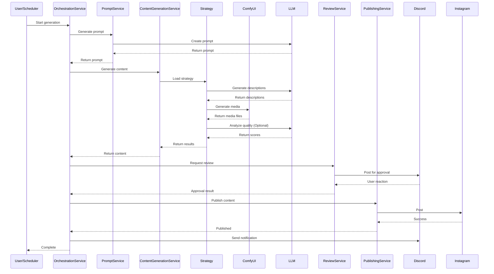

# Architecture Overview

This document outlines the system design, service interactions, and execution workflows for MediaOverload.

## Table of Contents
- [System Architecture](#system-architecture)
- [Generation Strategy Pattern](#generation-strategy-pattern)
- [Execution Flow](#execution-flow)
- [Data Flow](#data-flow)
- [Database Schema](#database-schema)
- [External Integrations](#external-integrations)
- [Error Handling](#error-handling)
- [Performance Considerations](#performance-considerations)
- [Extending the System](#extending-the-system)

---

## System Architecture

MediaOverload follows a **service-oriented architecture** with a clear separation of concerns.

### High-Level Components

```
┌─────────────────────────────────────────────────────────┐
│                    Entry Points                         │
│  ┌──────────────────┐      ┌────────────────────────┐  │
│  │  Scheduler       │      │  Manual Execution      │  │
│  │  (automated)     │      │  (run_media_interface) │  │
│  └──────────────────┘      └────────────────────────┘  │
└────────────────┬────────────────────┬───────────────────┘
                 │                    │
                 v                    v
┌─────────────────────────────────────────────────────────┐
│              ServiceFactory (DI Container)              │
└────────────────────┬────────────────────────────────────┘
                     │
                     v
┌─────────────────────────────────────────────────────────┐
│              OrchestrationService                       │
│  (Coordinates entire content generation pipeline)       │
└──┬──────┬──────┬──────┬──────┬──────────────────────────┘
   │      │      │      │      │
   v      v      v      v      v
┌────┐ ┌────┐ ┌────┐ ┌────┐ ┌────┐
│Pmt │ │Cnt │ │Rev │ │Pub │ │Not │  Services
│Svc │ │Svc │ │Svc │ │Svc │ │Svc │
└────┘ └────┘ └────┘ └────┘ └────┘
```

### Core Services

- **OrchestrationService**: The central coordinator. It manages the lifecycle of the entire pipeline, handles errors, and ensures resources are cleaned up.
- **PromptService**: Generates text prompts. It can create prompts from scratch ("arbitrary"), based on news ("news"), or involving multiple characters ("two_character").
- **ContentGenerationService**: Manages media creation. It delegates the actual generation logic to specific strategies (e.g., Text2Image, Text2Video).
- **ReviewService**: Handles human-in-the-loop verification. It posts content to Discord and waits for user approval (via emoji reactions).
- **PublishingService**: Manages social media interactions. It handles format conversion and publishing to platforms like Instagram and Twitter.
- **NotificationService**: Keeps the user informed. It sends status updates, error reports, and completion notifications to Discord.

---

## Generation Strategy Pattern

MediaOverload uses the **Strategy Pattern** to handle different media types uniformly.

```
┌──────────────────────────────────────┐
│      StrategyFactory                 │
│  (Creates strategy based on type)    │
└──────────────┬───────────────────────┘
               │
               │ Creates based on generation_type
               v
┌──────────────────────────────────────────────────────┐
│            BaseGenerationStrategy (Abstract)         │
│  - generate_description()                            │
│  - generate_media()                                  │
│  - analyze_media_text_match()                        │
│  - generate_article_content()                        │
└──────┬───────────────┬────────────────┬──────────────┘
       │               │                │
       v               v                v
┌──────────┐   ┌──────────────┐   ┌────────────┐
│ Text2Img │   │ Text2Video   │   │ Image2Img  │
│ Strategy │   │ Strategy     │   │ Strategy   │
└──────────┘   └──────────────┘   └────────────┘
```

### Strategy Types

1.  **Text2ImageStrategy**: Standard text-to-image generation using ComfyUI. Fast and reliable.
2.  **Image2ImageStrategy**: Transforms an input image into a new style or variation. Uses controllable denoising.
3.  **Text2Image2ImageStrategy**: A two-stage process. First, it generates multiple base images from text. Then, it filters them by quality and refines the best ones using image-to-image.
4.  **Text2VideoStrategy**: Direct text-to-video generation, optionally with sound effects.
5.  **Text2Image2VideoStrategy**: A complex multi-stage workflow involving image generation, user review, and video synthesis.

---

## Execution Flow

### Complete Pipeline

1.  **Initialization**: Load character config and select a random character if a group is specified.
2.  **Prompt Generation**:
    *   **Arbitrary**: LLM creates a creative prompt.
    *   **News**: System fetches news from the DB; LLM creates a relevant scene.
    *   **Interaction**: System fetches a second character; LLM creates an interaction scene.
3.  **Strategy Selection**: The system instantiates the appropriate strategy based on `generation_type`.
4.  **Description Generation**: LLM expands the prompt into detailed visual descriptions using the selected `image_system_prompt`.
5.  **Media Generation**: ComfyUI generates the media (images or videos).
6.  **Quality Control**:
    *   **Vision Analysis**: (Optional) Gemini/OpenRouter analyzes image-text alignment.
    *   **Filtering**: Images below `similarity_threshold` are discarded.
7.  **Article Generation**: LLM creates a social media caption, adds hashtags, and formats the text.
8.  **Review**: Content is posted to a private Discord channel. The system waits for a ✅ or ❌ reaction.
9.  **Publishing**: If approved, the content is published to enabled platforms (Instagram, Twitter).
10. **Notification**: A final success/failure report is sent to Discord.
11. **Cleanup**: Temporary files are deleted and connections closed.

### Sequence Diagram



---

## Data Flow

### Character Configuration

The configuration system uses a layered approach:

1.  **YAML Config File**: The source of truth.
2.  **ConfigLoader**: Reads the YAML and processes weighted random choices (e.g., selecting one style from `style_weights`).
3.  **CharacterConfig**: A dataclass that holds the resolved configuration for the current run.
4.  **ConfigurableCharacter**: The runtime object used by services.

### Weighted Random Selection

To ensure variety, the system uses weighted random selection for several parameters:

```python
# Example: generation_type_weights
weights = {
    'text2img': 0.6,       # 60% chance
    'text2image2image': 0.4 # 40% chance
}
```

This logic applies to:
- `generation_type`
- `generate_prompt_method`
- `image_system_prompt`
- `style`

---

## Database Schema

### Character Group Table (`anime_roles`)

Used to group characters for random selection.

| Column | Type | Description |
| :--- | :--- | :--- |
| `id` | INT | Primary Key |
| `role_name_en` | VARCHAR | Character name (must match config filename) |
| `group_name` | VARCHAR | Group identifier (e.g., "Kirby") |
| `status` | INT | 1 = Active, 0 = Disabled |
| `weight` | INT | Selection probability |

### News Table (`news`)

Used for news-based prompt generation.

| Column | Type | Description |
| :--- | :--- | :--- |
| `id` | INT | Primary Key |
| `title` | VARCHAR | News headline |
| `keyword` | VARCHAR | Key topic |
| `content` | TEXT | Full content/summary |
| `publish_date` | DATE | Date of publication |

---

## External Integrations

### ComfyUI
- **Role**: Image and video generation engine.
- **Connection**: WebSocket (for progress) + HTTP API (for queuing).
- **Port**: 8188.

### LLM Providers
- **Ollama**: Local, free inference (Llama 3, Qwen).
- **Google Gemini**: Cloud-based, excellent vision capabilities.
- **OpenRouter**: Aggregator for various models (Claude, GPT-4, etc.).

### Discord
- **Review Bot**: Interactive bot for approving/rejecting content.
- **Webhooks**: One-way channel for status notifications and error logs.

### Social Media
- **Instagram**: Uses custom `lib/instagram` module for photo/video uploads and story sharing.
- **Twitter/X**: Uses official API v2 for tweeting text and media.

---

## Error Handling

The system is designed to be resilient:

- **Retries**: Database queries and API calls have configurable retry logic with exponential backoff.
- **Fallbacks**: If a primary LLM fails (e.g., Ollama), the system can fall back to OpenRouter or Gemini.
- **Graceful Failure**: If publishing fails, the content is saved locally, and the error is logged to Discord. The pipeline doesn't crash; it reports and cleans up.

---

## Performance Considerations

- **Bottlenecks**: ComfyUI generation is the slowest part (30s - 5min). Vision analysis also adds latency.
- **Optimization**:
    - Use `examples/quick_draw` scripts to skip analysis during testing.
    - Lower `images_per_description` in config to speed up generation.
    - Use faster workflows (e.g., Flux Krea) for rapid iteration.
- **Resources**: Video generation requires significant VRAM (8GB+).

---

## Extending the System

### Adding a New Platform
1.  Create a class in `lib/social_media/` implementing `SocialMediaPlatform`.
2.  Register it in `PublishingService`.
3.  Add configuration support in `ConfigurableCharacterWithSocialMedia`.

### Adding a New Strategy
1.  Create a class in `lib/media_auto/strategies/` inheriting from `BaseGenerationStrategy`.
2.  Implement the required methods (`generate_media`, etc.).
3.  Register it in the strategy factory.

### Adding a New Prompt Template
1.  Add the template string to `configs/prompt/image_system_guide.py`.
2.  Reference it in your character config under `image_system_prompt_weights`.
