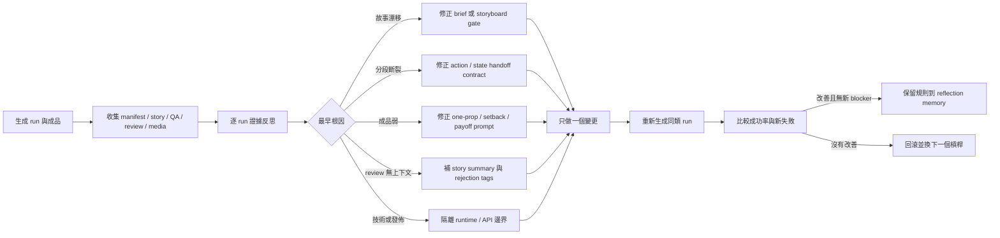

# MediaOverload 自我反思與內容優化 loop

這套流程把「反思」定義成可追溯的品質控制，不是讓模型泛泛地說「下次 prompt 寫好一點」。每一輪都要從 run manifest、故事 records、review session、technical/semantic QA，以及本機能取得的影片證據開始，先定位流程中最早的失效點，再只改一個槓桿。



## 每個 run 的反思欄位

- `observed_evidence`: 來源 prompt、storyboard path、segment action/state、review session、QA 狀態與本機成品路徑。
- `root_cause`: 只描述流程根因，例如 `storyboard_drift`、`segment_contract_gap`、`review_context_missing`，不把「某張圖不好看」當成根因。
- `severity`: `blocker` 會在生成前阻擋；`high` 要先修流程；`medium` 進入下一輪實驗；`boundary` 是技術、review 可用性或發佈問題，不得誤改創意 prompt。
- `next_experiment`: 下一輪只改一件事，例如「移除 news-driven longvideo 的靜態 storyboard default」。
- `comparison_signal`: 同時保存 technical QA、semantic QA、人工 rejection tags 與最終成品；任何單一分數都不能代表內容合格。

## 本 repo 的硬規則

1. 長片不能無條件套用固定 Meadow 故事。當 prompt 是新聞或當輪 brief，必須先確認 source anchor 仍出現在 story/segment 中。
2. 每一段都要有 `action`、`camera`、`start_state`、`end_state`、`cause`、`effect`；缺欄位在 render 前失敗，不把空欄位交給模型猜。
3. 可愛短片以一個 dominant news mechanism 為主，必須看得到 source context → active mechanism → visible consequence，再落到 anticipation → contact/impact → readable reaction → settled payoff；prop 只是可選表現，不是新聞的固定容器。
4. Review 訊息必須帶真正的故事摘要；Reject 必須留下結構化原因，例如 `story_drift`、`weak_first_action`、`no_payoff`、`identity_drift` 或 `technical_artifact`。
5. Technical QA 只證明檔案可播放；semantic QA 只證明抽樣畫面符合 rubric；兩者都不能取代藝術觀眾對節奏、因果與笑點的判斷。

## 執行

```powershell
python scripts/run_creative_reflection.py --count 20
```

輸出會放在 `logs/reflections/`：

- `creative_reflection_<timestamp>.json`: 可供下一輪工具讀取的逐 run evidence。
- `creative_reflection_<timestamp>.md`: 人類可讀的逐 run 反思與 batch diagnosis。
- `reflection_memory.json`: 目前只保存已明確證據支持的流程規則，不會自動改寫全域記憶或 prompt。

## 第一輪已落地的優化

- `configs/characters/kirby.yaml` 不再為 news-driven longvideo 指定固定 Meadow 故事；新 run 會從當輪 brief 產生段落。
- 故事段落現在要求 `action`、`camera`、狀態起訖與因果欄位，並在 render 前執行 story-anchor gate；空動作或完全偏離 brief 會先停止。
- 所有 route 的 review 摘要會優先讀取 native story、script plan 或當輪 objective，避免 reviewer 只看到「未提供故事摘要」。
- `native_h3_t2v_story` 已改為必須執行且阻擋式 semantic QA；但 semantic QA 仍只是一個訊號，不能取代人工觀眾。
- Native H3 的 news contract v2 要求 `news_mechanism`、`news_consequence` 與 `context / mechanism / consequence` 三類 anchor；QA 會阻擋只有單一 orb、balloon、wallet 或其他重複物件而沒有事件機制的故事。

本輪尚未重新呼叫 ComfyUI/GPU 或重試外部發佈；下一個有界實驗是重新生成一個同類 `text2longvideo`，確認故事不再漂移，再比較成品的動作、連貫性與 payoff。Reject 結構化 tags 仍是下一個 review-side 優化，不會用猜測的理由覆寫既有 review。

## 研究依據與取捨

- [Self-Refine](https://arxiv.org/abs/2303.17651) 提供 generate → feedback → refine 的基本迭代結構；本 repo 把 feedback 改成成品 evidence 與流程根因。
- [Reflexion](https://arxiv.org/abs/2303.11366) 強調把試錯結果轉成可在下一輪使用的語言記憶；本 repo 先以 `reflection_memory.json` 保存可驗證規則，再決定哪些規則能注入 prompt。
- [Constitutional AI](https://arxiv.org/abs/2212.08073) 示範以明確原則批判與修訂；本 repo 的「一個道具、一個受阻、一個 payoff、不可故事漂移」就是針對 Kirby 短片的內容 constitution。

第一版刻意不自動呼叫 LLM 重跑，也不自動批量改寫 config；已完成的 config 與流程 gate 是小範圍、可回滾的人工審核變更。先用下一個同類 run 驗證，再把高信度規則注入更廣的故事生成器。
